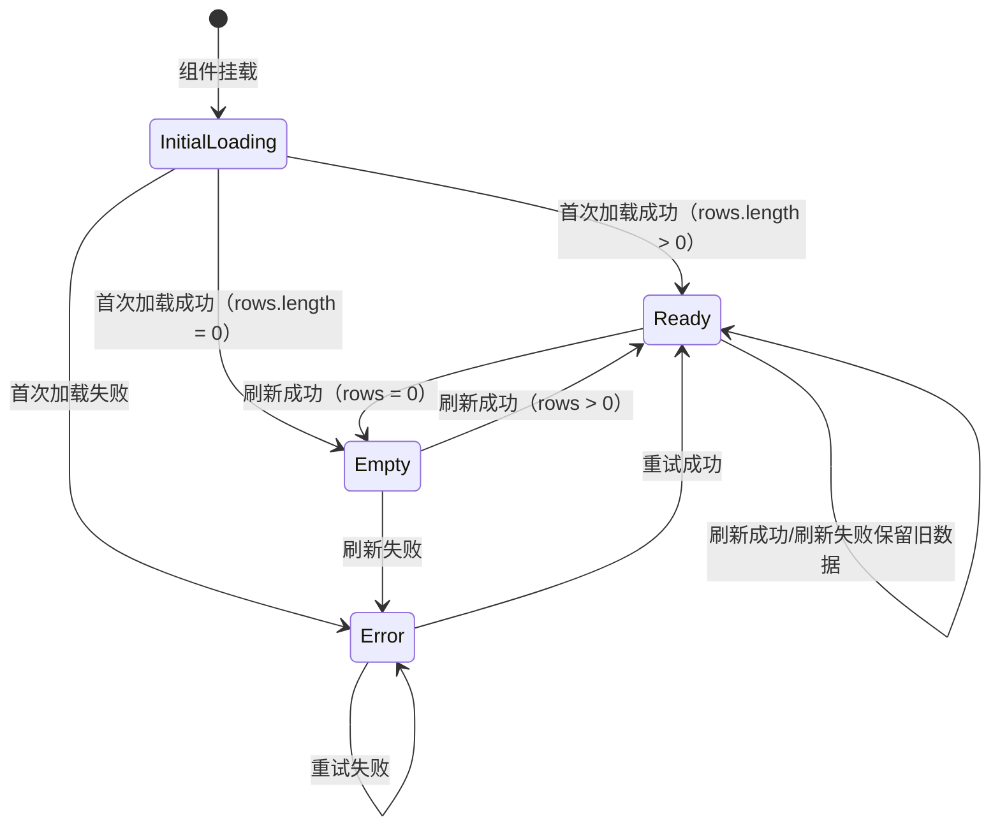
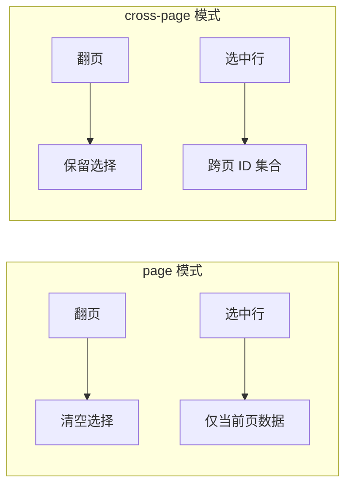
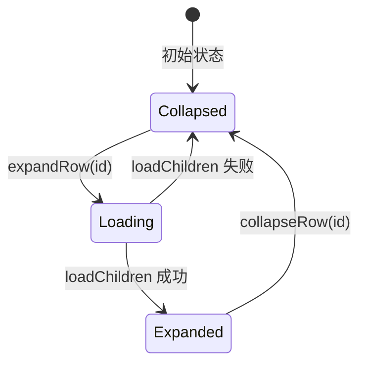
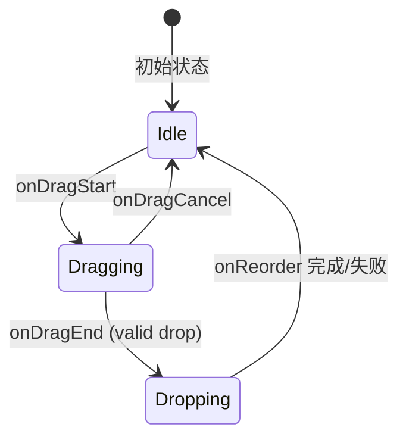

# 表格组件 V2 设计文档

本文档描述一个“彻底不兼容升级”的表格组件体系。它以 **Headless 内核 + 状态/数据源适配器 + UI 组合组件** 为核心，目标是让业务接入表格时只需要配置：列定义、数据源、状态来源与功能开关，其他能力均标准化、可复用、可持久化。

> 范围：仅描述对外 API 与模块分层设计，不包含具体实现代码。

---

## 1. 背景与问题

当前体系具备良好的架构原则（以 TanStack Table 的 `table` 实例为单一事实来源），但在实际使用中仍存在“能力入口分散”的现象：

- URL 同步：业务层 `useDataTable`、组件层 `DataTableSearch` 都会操作 URL（两套口径）。
- UI 状态：`loading/empty/fetching/error` 在 Hook 与 UI 之间缺少统一状态模型，导致调用方需要拼装 props。
- 功能扩展：列显示、列宽、固定列、选择/批量操作等能力缺少统一的 feature 接入方式与持久化约束。
- 组合方式过多：`PaginatedTable`、`DataTableContainer`、`DataTablePagination`、`DataTableToolbar`、`DataTableFilterBar` 的责任边界可以更清晰并进一步收敛。

V2 方案以“统一 dt（data-table instance）模型”为中心，通过适配器与 feature 配置，把分散能力收敛到一个核心 API。

---

## 2. 目标与非目标

### 2.1 目标

- 一个核心 Hook：`useDataTable()` 统一产出 `dt`（包含 table、状态、动作、分页、筛选）。
- UI 组件只消费 `dt`：不再要求调用方显式传 `loading/empty/pagination/onPageChange...`。
- 状态来源可插拔：支持 `URL` / `受控` / `内部` 三种模式，且对业务暴露一致的 `dt.filters` 与 `dt.actions`。
- 数据源可插拔：支持 `remote`（TanStack Query）与 `local`（前端数据）等统一接口。
- 功能以 feature 开关接入：selection、columnVisibility、columnSizing、pinning、expansion、density 等按需启用并可持久化。
- 全局/局部 i18n 统一：所有文本与可访问性名称都通过 config 统一管理，组件可局部覆盖。

### 2.2 非目标

- 不追求与现有 API 兼容。
- 不在 V2 第一阶段实现虚拟滚动；只预留 API 形状。
- 不在 Hook 内部绑定具体 UI 组件库（shadcn），UI 层单独实现。

---

## 3. 核心设计原则

- **Single Source of Truth**：所有表格交互状态（排序、筛选、分页、选择、列可见性、列宽等）最终进入 TanStack Table 的 state（或与其一一映射）。
- **One dt to rule them all**：业务只拿到一个 `dt` 对象作为表格的唯一入口。
- **Adapters over branches**：URL/受控/内部状态通过适配器实现，不在业务层写分支逻辑。
- **Features are configuration**：功能通过 `features` 描述，而非“额外组件 + 额外状态 + 额外约定”。
- **UI is a pure consumer**：UI 只读取 `dt` 并调用 `dt.actions`，不再自行操作 URL、Query、TanStack Table state。

---

## 4. 对外 API（建议形态）

### 4.1 `useDataTable`：统一入口

```ts
export interface UseDataTableOptions<TData, TFilterSchema> {
  // 使用 `never` 作为 TValue：允许异构列（string/number/...）在同一个数组中共存，且调用方无感知
  columns: ColumnDef<TData, never>[]
  dataSource: DataSource<TData, TFilterSchema>
  state: TableStateAdapter<TFilterSchema>
  features?: DataTableFeatures<TData, TFilterSchema>
  getRowId?: (row: TData) => string
}

export function useDataTable<TData, TFilterSchema>(
  options: UseDataTableOptions<TData, TFilterSchema>,
): DataTableInstance<TData, TFilterSchema>
```

### 4.2 `DataTableInstance`：统一返回值

```ts
export type DataTableStatus =
  | { type: "error"; error: unknown }
  | { type: "empty" }
  | { type: "ready" }

export interface DataTableActivity {
  isInitialLoading: boolean
  isFetching: boolean
  preferencesReady: boolean
}

export interface DataTablePagination {
  page: number
  size: number
  pageCount: number
  total?: number
}

// selection 始终存在，未启用时 enabled=false，其余字段为默认空值
export interface DataTableSelection<TData> {
  enabled: boolean
  mode: "page" | "cross-page"
  selectedRowIds: string[]
  selectedRowsCurrentPage: TData[]
}

// tree 始终存在，未启用时 enabled=false
export interface DataTableTree {
  enabled: boolean
  expandedRowIds: string[]
  loadingRowIds: string[]  // 正在懒加载子节点的行
}

// dragSort 始终存在，未启用时 enabled=false
export interface DataTableDragSort {
  enabled: boolean
  isDragging: boolean
  activeId: string | null
}

export interface DataTableInstance<TData, TFilterSchema> {
  table: Table<TData>
  status: DataTableStatus
  activity: DataTableActivity
  pagination: DataTablePagination
  filters: TableFilters<TFilterSchema>
  actions: DataTableActions
  selection: DataTableSelection<TData>  // 始终存在，通过 enabled 判断是否可用
  tree: DataTableTree                    // 始终存在，通过 enabled 判断是否可用
  dragSort: DataTableDragSort            // 始终存在，通过 enabled 判断是否可用
  errors?: {
    blocking?: unknown
    nonBlocking?: unknown
  }
  meta: {
    feature: {
      selectionEnabled: boolean
      columnVisibilityEnabled: boolean
      columnSizingEnabled: boolean
      pinningEnabled: boolean
      expansionEnabled: boolean
      densityEnabled: boolean
      treeEnabled: boolean
      dragSortEnabled: boolean
    }
    data?: {
      extraMeta?: Record<string, unknown>
    }
  }
}
```

说明：

- `status` 只表达“主渲染态”。当已有可渲染数据但本轮刷新失败时，`status` 仍为 `ready`，错误写入 `errors.nonBlocking`，UI 以轻量提示/按钮重试呈现，不打断阅读。
- `activity.preferencesReady` 用于表达偏好（列显隐/列宽/density 等）是否已完成 hydration；避免“先用默认值渲染 → 异步回填跳变”。
- `selection` **始终存在**，通过 `enabled` 字段判断能力是否启用（未启用时 `enabled=false`，其余字段为默认空值）。这样设计避免业务层每次使用都需要判断可空性。`selectedRowsCurrentPage` 永远只代表当前页可见行数据，跨页批量应以 `selectedRowIds` 为主。

### 4.3 `actions`：所有交互动作统一出口

> **设计原则**：所有方法始终存在，未启用对应 feature 时为 no-op（空函数）。这样设计让调用方无需判断方法是否存在，API 签名更稳定。

```ts
export interface DataTableActions {
  // 数据操作
  refetch: () => void | Promise<void>       // 刷新数据，非远程数据源时为 no-op
  retry: (options?: { resetInvalidFilters?: boolean }) => void | Promise<void>  // 重试失败请求，无错误时为 no-op
  resetAll: () => void                      // 重置所有状态

  // 分页与排序
  setPage: (page: number) => void
  setPageSize: (size: number) => void
  setSort: (sort: { field: string; order: "asc" | "desc" }[]) => void  // 数组格式，单列时只传一个元素，空数组清除排序
  clearSort: () => void

  // 选择操作（未启用 selection 时为 no-op）
  clearSelection: () => void
  selectAllCurrentPage: () => void
  selectAllMatching: () => void | Promise<void>

  // 偏好重置（未启用对应 feature 时为 no-op）
  resetColumnVisibility: () => void
  resetColumnSizing: () => void
  resetDensity: () => void

  // 树形操作（未启用 tree 时为 no-op）
  expandRow: (rowId: string) => void
  collapseRow: (rowId: string) => void
  toggleRowExpanded: (rowId: string) => void
  expandAll: () => void
  collapseAll: () => void
  expandToDepth: (depth: number) => void

  // 拖拽排序操作（未启用 dragSort 时为 no-op）
  moveRow: (activeId: string, overId: string) => void | Promise<void>
}
```

### 4.4 `filters`：强类型筛选模型（替代松散的 Record）

```ts
export interface TableFilters<TFilterSchema> {
  state: TFilterSchema
  set: <K extends keyof TFilterSchema>(key: K, value: TFilterSchema[K]) => void
  setBatch: (updates: Partial<TFilterSchema>) => void  // 批量更新，只触发一次状态变更
  reset: () => void
}
```

说明：

- `TFilterSchema` 由状态适配器决定（URL/受控/内部）。
- URL 模式下建议由 parser/schema 推导出值类型，避免 `any`。

---

## 5. 核心契约（必须形式化）

V2 的可控性来自“接口契约硬约束 + 组合顺序确定”。核心约定：

- State Adapter 只负责“读写状态 + 业务行为约定（例如筛选变化重置 page）”，不负责发请求与拼 queryKey。
- Data Source 只负责“把 query 变成 rows + pagination + activity”，不关心 URL 与 UI。
- Feature 以统一运行时接口注入 tableOptions/state/actions/meta，core 不能靠 if/else 堆叠能力。

### 5.1 `TableStateAdapter<TFilterSchema>`

```ts
export interface TableSort {
  field: string
  order: "asc" | "desc"
}

export interface TableStateSnapshot<TFilterSchema> {
  page: number
  size: number
  sort: TableSort[]  // 数组格式，空数组表示无排序；单列排序时只使用第一个元素
  filters: TFilterSchema
}

export type TableStateChangeReason =
  | "init"
  | "page"
  | "size"
  | "sort"
  | "filters"
  | "reset"

export interface TableStateAdapter<TFilterSchema> {
  getSnapshot: () => TableStateSnapshot<TFilterSchema>
  setSnapshot: (
    next: TableStateSnapshot<TFilterSchema>,
    reason: TableStateChangeReason,
  ) => void
  subscribe: (listener: () => void) => () => void
}
```

约定：

- `getSnapshot` 必须同步可用（用于首屏初始化）。URL/受控/内部三种模式都要满足。
- `setSnapshot` 的行为约束（例如筛选变化自动 page=1）必须在 adapter 内完成，避免 core 与 UI 重复实现。
- `subscribe` 仅用于驱动 core 重新计算 query 与触发 dataSource；UI 不直接订阅 adapter。

### 5.2 `DataSource<TData, TFilterSchema>`

```ts
export interface DataTableQuery<TFilterSchema> {
  page: number
  size: number
  sort: { field: string; order: "asc" | "desc" } | null
  filters: TFilterSchema
}

export interface DataTableDataResult<TData> {
  rows: TData[]
  pageCount: number
  total?: number
  extraMeta?: Record<string, unknown>
}

export interface DataTableDataState<TData> {
  data: DataTableDataResult<TData> | null
  isInitialLoading: boolean
  isFetching: boolean
  error: unknown | null
  refetch?: () => void | Promise<void>
  retry?: () => void | Promise<void>
}

export interface DataSource<TData, TFilterSchema> {
  use: (query: DataTableQuery<TFilterSchema>) => DataTableDataState<TData>
}
```

约定：

- `query.filters` 必须保持强类型贯通，dataSource 不得退化为 `Record<string, unknown>`。
- dataSource 可以自行决定缓存与请求策略（例如 TanStack Query），但不拥有 URL 读写权。

### 5.3 `DataTableFeature<TData, TFilterSchema>`（运行时接口）

```ts
export interface DataTableFeatureRuntime<TData, TFilterSchema> {
  patchTableOptions?: (args: {
    getRowId?: (row: TData) => string
  }) => Partial<TableOptions<TData>>
  patchActions?: (actions: DataTableActions) => Partial<DataTableActions>
  patchMeta?: (meta: DataTableInstance<TData, TFilterSchema>["meta"]) => unknown
  patchActivity?: (activity: DataTableActivity) => Partial<DataTableActivity>
  onReset?: () => void
}
```

约定：

- core 以确定顺序应用 features：`state -> features -> table -> dataSource -> dt`。
- feature 不得直接依赖 URL/Query，只能通过 runtime patch 与 storage/hydration 接口间接影响行为。

---

## 6. 状态适配器（State Adapters）

状态适配器负责提供：

- 初始状态（page/size/sort/filters）
- 状态变更写入（URL / props 回调 / 内部 state）
- 业务约定（例如 filter 或搜索改变时自动把 page 重置为 1）

### 6.1 `state.url(...)`

```ts
export interface TableCodec<TOutput> {
  parse: (input: Record<string, string | string[] | undefined>) => TOutput
  serialize: (value: TOutput) => Record<string, string | null | undefined>
}

export type UrlStateMiddleware<TFilterSchema> = (args: {
  prev: { page: number; size: number; sort: { field: string; order: "asc" | "desc" }[]; filters: TFilterSchema }
  next: { page: number; size: number; sort: { field: string; order: "asc" | "desc" }[]; filters: TFilterSchema }
}) => {
  page: number
  size: number
  sort: { field: string; order: "asc" | "desc" }[]
  filters: TFilterSchema
}

export interface UrlStateOptions<TParsers> {
  key: string
  parsers?: TParsers
  codec?: TableCodec<InferParserValues<TParsers>>
  defaults?: Partial<InferParserValues<TParsers>>
  behavior?: {
    history?: "push" | "replace"
    resetPageOnFilterChange?: boolean
    resetPageOnSearchChange?: boolean
    middleware?: UrlStateMiddleware<InferParserValues<TParsers>>
  }
}

export function stateUrl<TParsers>(
  options: UrlStateOptions<TParsers>,
): TableStateAdapter<InferParserValues<TParsers>>
```

约定：

- `page/size/sort/q` 等保留字段由 V2 统一管理，不再允许组件各自写入。
- `sort` 字符串序列化规范统一为 `field.asc|field.desc`（或 `field.asc` 这种），由 adapter 解析与生成。
- URL 入参天然是字符串，`parsers/codec` 是唯一的类型转换入口；业务不得在 UI 层自行做 string → number/date 的隐式转换。
- 默认实现路径以 TanStack Router 的 search 语义为准：adapter 通过 Router 的 search 读写完成状态同步；`key` 用作命名空间前缀，避免与页面其他 search 参数冲突。
- **V2.0 约束**：`TFilterSchema` 必须为扁平对象（仅一层 key/value），不支持嵌套结构，避免 codec 与 URL 映射复杂度爆炸。
- **数组格式规范**：URL 多值参数统一使用重复 key（例如 `?status=a&status=b`），禁止逗号拼接（`?status=a,b`）以避免歧义。

强类型建议：

- 优先使用 TanStack Router 的搜索校验/解析能力（例如 schema/validator），`codec` 作为可选的严格校验入口（例如 `zod`），将校验失败映射为默认值或剔除非法字段。

### 6.2 `state.controlled(...)`

```ts
export interface ControlledStateOptions<TFilterSchema> {
  value: {
    page: number
    size: number
    sort: { field: string; order: "asc" | "desc" }[]
    filters: TFilterSchema
  }
  onChange: (next: ControlledStateOptions<TFilterSchema>["value"]) => void
  behavior?: {
    resetPageOnFilterChange?: boolean
  }
}

export function stateControlled<TFilterSchema>(
  options: ControlledStateOptions<TFilterSchema>,
): TableStateAdapter<TFilterSchema>
```

### 6.3 `state.internal(...)`

```ts
export interface InternalStateOptions<TFilterSchema> {
  initial: {
    page?: number
    size?: number
    sort?: { field: string; order: "asc" | "desc" }[]
    filters?: TFilterSchema
  }
  behavior?: {
    resetPageOnFilterChange?: boolean
  }
}

export function stateInternal<TFilterSchema>(
  options: InternalStateOptions<TFilterSchema>,
): TableStateAdapter<TFilterSchema>
```

---

## 7. 数据源适配器（Data Sources）

数据源只负责“给 rows + 分页信息”，不关心 UI、URL、feature。

### 7.1 `dataSource.remote(...)`（TanStack Query）

```ts
export interface RemoteDataSourceOptions<TData, TFilterSchema, TResponse> {
  queryKey: unknown[]
  queryFn: (params: {
    page: number
    size: number
    sort: { field: string; order: "asc" | "desc" }[]
    filters: TFilterSchema
  }) => Promise<TResponse>
  map: (response: TResponse) => {
    rows: TData[]
    pageCount: number
    total?: number
    extraMeta?: Record<string, unknown>
  }
}

export function remote<TData, TFilterSchema, TResponse>(
  options: RemoteDataSourceOptions<TData, TFilterSchema, TResponse>,
): DataSource<TData, TFilterSchema>
```

约定：

- `queryKey` 由 core 统一追加 state 依赖（filters/sort/page/size），业务无需手动拼接。
- `map` 是唯一的“非标准响应格式”入口。
- `extraMeta` 用于保留后端返回的业务汇总信息，core 应将其透传到 `dt.meta.data.extraMeta`。
- 必须明确区分“进入 queryKey 的状态”和“只进入 queryFn 的参数”，避免缓存污染与不必要 refetch。
- `filters/sort` 用于 queryKey 时必须稳定化（例如结构化序列化、稳定 key 排序或结构共享）；稳定化策略由 core 统一完成，避免业务各自实现导致缓存碎片化。

### 7.2 `dataSource.local(...)`

```ts
export interface LocalDataSourceOptions<TData> {
  rows: TData[]
  total?: number
}

export function local<TData, TFilterSchema>(
  options: LocalDataSourceOptions<TData>,
): DataSource<TData, TFilterSchema>
```

---

## 8. Feature 配置（Features）

feature 的职责是：声明需要哪些 TanStack state、是否持久化、是否注入额外列/工具组件所需信息。

```ts
export interface TablePreferenceStorage<TValue> {
  getSync?: (key: string) => TValue | null
  get: (key: string) => Promise<TValue | null>
  set: (key: string, value: TValue) => Promise<void>
  remove?: (key: string) => Promise<void>
}

// 统一 feature 配置格式：{ enabled?: boolean, ...options }
// 所有 feature 的 enabled 默认为 true（传入配置对象即表示启用）

export interface SelectionFeatureOptions {
  enabled?: boolean
  mode?: "page" | "cross-page"
}

export interface ColumnVisibilityFeatureOptions {
  enabled?: boolean
  storageKey: string
  defaultVisible?: Record<string, boolean>
  storage?: TablePreferenceStorage<Record<string, boolean>>
}

export interface ColumnSizingFeatureOptions {
  enabled?: boolean
  storageKey: string
  defaultSizing?: Record<string, number>
  storage?: TablePreferenceStorage<Record<string, number>>
}

export interface PinningFeatureOptions {
  enabled?: boolean
  left?: string[]
  right?: string[]
}

export interface ExpansionFeatureOptions<TData> {
  enabled?: boolean
  getRowCanExpand?: (row: Row<TData>) => boolean
}

export interface DensityFeatureOptions {
  enabled?: boolean
  storageKey: string
  default?: "compact" | "comfortable"
  storage?: TablePreferenceStorage<"compact" | "comfortable">
}

export interface TreeFeatureOptions<TData> {
  enabled?: boolean
  /** 获取行的子节点（同步数据） */
  getSubRows?: (row: TData) => TData[] | undefined
  /** 懒加载子节点（异步数据） */
  loadChildren?: (row: TData) => Promise<TData[]>
  /** 判断行是否可展开（用于懒加载场景，避免请求才知道有无子节点） */
  getRowCanExpand?: (row: TData) => boolean
  /** 默认展开的深度，0 表示全部折叠，Infinity 表示全部展开 */
  defaultExpandedDepth?: number
  /** 默认展开的行 ID 列表 */
  defaultExpandedRowIds?: string[]
  /** 缩进宽度（像素），默认 24 */
  indentSize?: number
  /** 展开/折叠时是否自动滚动到视口 */
  scrollOnExpand?: boolean
}

export interface DragSortFeatureOptions<TData> {
  enabled?: boolean
  /** 拖拽完成后的回调，返回 Promise 时会等待完成 */
  onReorder: (args: {
    activeId: string
    overId: string
    activeIndex: number
    overIndex: number
    activeRow: TData
    overRow: TData
    /** 重排后的完整行数据（仅 local 数据源时可用） */
    reorderedRows?: TData[]
  }) => void | Promise<void>
  /** 是否使用拖拽手柄，false 时整行可拖拽 */
  handle?: boolean
  /** 判断行是否可被拖拽 */
  canDrag?: (row: TData) => boolean
  /** 判断行是否可作为放置目标 */
  canDrop?: (activeRow: TData, overRow: TData) => boolean
  /** 拖拽时的视觉反馈模式 */
  dragOverlay?: "row" | "ghost" | "minimal"
  /** 树形数据拖拽时是否允许改变层级（需同时启用 tree） */
  allowNesting?: boolean
}

export interface DataTableFeatures<TData, TFilterSchema> {
  selection?: SelectionFeatureOptions
  columnVisibility?: ColumnVisibilityFeatureOptions
  columnSizing?: ColumnSizingFeatureOptions
  pinning?: PinningFeatureOptions
  expansion?: ExpansionFeatureOptions<TData>
  density?: DensityFeatureOptions
  tree?: TreeFeatureOptions<TData>
  dragSort?: DragSortFeatureOptions<TData>
}
```

约定：

- **统一配置格式**：所有 feature 配置都包含 `enabled` 字段（默认 `true`）。如需禁用已配置的 feature，设置 `enabled: false`。
- 如果 `selection` 启用，core 将提供一个标准的 selection column 工厂（或直接注入）。
- `selection.mode = "page"`：翻页后不保留上一页选择（默认更简单，适配大多数场景）。
- `selection.mode = "cross-page"`：必须提供 `getRowId`，且 selection 内部语义升级为“选中的 RowId 集合”；翻页后可重建选中状态。
- 如果 `columnVisibility/columnSizing/density` 启用，必须指定 `storageKey`，避免“没持久化导致体验不一致”。
- 偏好存储 hydration：优先使用 `getSync`（例如 localStorage）在首屏同步注入，`get` 作为异步兜底（例如 indexedDB/远端）；当存在异步 hydration 时，core 必须将 `activity.preferencesReady` 置为 `false`，并在 hydration 完成后再置为 `true`，以便 UI 避免布局跳变。
- 偏好存储值必须具备版本与迁移空间：建议统一使用带 `schemaVersion` 的 envelope，并在列定义变更时执行“删除无效 key / 新增列补默认值 / 非法值修正”的合并规则（见 25）。
- 当业务发生列重命名等不可自动推断的变更时，偏好 feature 应允许提供迁移函数，将旧 key 映射到新 key（见 25.3）。

---

## 9. UI API（组件层，对外导出建议）

UI 层只依赖 `dt`，不直接依赖 URL/Query。

### 9.1 Root 与子组件

```tsx
export type DataTableScrollContainer = "root" | "window"

export interface DataTableLayoutOptions {
  scrollContainer?: DataTableScrollContainer
  stickyHeader?: boolean | { topOffset?: number }
  stickyPagination?: boolean | { bottomOffset?: number }
}

export function DataTableRoot<TData, TFilterSchema>(props: {
  dt: DataTableInstance<TData, TFilterSchema>
  height?: string
  className?: string
  layout?: DataTableLayoutOptions
  children: ReactNode
}): JSX.Element

export function DataTablePreset<TData, TFilterSchema>(props: {
  dt: DataTableInstance<TData, TFilterSchema>
  height?: string
  className?: string
  layout?: DataTableLayoutOptions
  toolbar?: ReactNode
  toolbarActions?: ReactNode
  renderEmpty?: () => ReactNode
  renderError?: (error: unknown, retry?: () => void | Promise<void>) => ReactNode
  selectionBarActions?: (args: {
    selectedRowIds: string[]
    selectedRowsCurrentPage: TData[]
    mode: "page" | "cross-page"
  }) => ReactNode
}): JSX.Element

export function DataTableToolbar(props: { children?: ReactNode }): JSX.Element
export function DataTableSearch(props: {
  filterKey?: string
  placeholder?: string
  debounceMs?: number
}): JSX.Element
export function DataTableColumnToggle(): JSX.Element
export function DataTableTable(props?: {
  renderEmpty?: () => ReactNode
  renderError?: (error: unknown, retry?: () => void | Promise<void>) => ReactNode
}): JSX.Element
export function DataTablePagination(): JSX.Element
export function DataTableSelectionBar<TData>(props: {
  actions?: (args: {
    selectedRowIds: string[]
    selectedRowsCurrentPage: TData[]
    mode: "page" | "cross-page"
  }) => ReactNode
}): JSX.Element
```

说明：

- 需要“一把梭”的标准 CRUD 列表，优先使用 `DataTablePreset`；需要深度定制时再回退到组合式（见 9.2）。
- `DataTableSearch` 只更新 `dt.filters.set(filterKey, value)`，默认 `filterKey = "q"`。
- `DataTableSearch.debounceMs` 默认 300ms；URL 模式下由 state adapter 负责将“输入态”和“已提交态”统一为一个规范（UI 不直接操作 URL）。
- `DataTablePagination` 调用 `dt.actions.setPage/setPageSize`，显示 `dt.pagination`。
- `DataTableTable` 仅渲染 table（header/body/empty/error/loading），其状态来自 `dt.status`。
- `DataTableSelectionBar` 以 `selectedRowIds` 为跨页批量的主入口；`selectedRowsCurrentPage` 仅用于“当前页批量”或展示选中摘要。
- 当 `selection.mode = "cross-page"` 时，UI 建议遵循跨页选择的标准交互（见 26.2），避免用户误解“到底选了多少条”。
- `layout` 属于 UI 布局能力，不进入 core features；core 不感知滚动容器与 sticky 行为。

### 9.2 默认布局（一把梭用法）

```tsx
const dt = useDataTable({
  columns,
  dataSource: remote({ queryKey: ["users"], queryFn: getUsers, map }),
  state: stateUrl({ key: "users", parsers }),
  features: { selection: true, columnVisibility: { storageKey: "users.columns" } },
})

return <DataTablePreset dt={dt} height="calc(100vh - 240px)" layout={{ scrollContainer: "root", stickyHeader: true }} />
```

如需定制 toolbar、selectionBar、pagination 的布局或插槽，可使用组合式 API：

```tsx
return (
  <DataTableRoot
    dt={dt}
    height="calc(100vh - 240px)"
    layout={{
      scrollContainer: "root",
      stickyHeader: true,
    }}
  >
    <DataTableToolbar>
      <DataTableSearch filterKey="q" />
      <DataTableColumnToggle />
    </DataTableToolbar>
    <DataTableTable />
    <DataTableSelectionBar
      actions={({ selectedRowIds, selectedRowsCurrentPage, mode }) => (
        <BatchActions
          selectedRowIds={selectedRowIds}
          selectedRowsCurrentPage={selectedRowsCurrentPage}
          mode={mode}
        />
      )}
    />
    <DataTablePagination />
  </DataTableRoot>
)
```

### 9.3 布局与滚动（Layout & Scrolling）

V2 将“表头吸顶 / 分页吸底”等能力定义为 UI 层布局规范，由 `DataTableRoot` 统一协调。这样可以保持 headless core 的纯粹性：core 只管理 `dt`（table/state/actions/data），不承载 DOM、滚动容器与 CSS sticky 语义。

#### 9.3.1 滚动容器策略

- `layout.scrollContainer = "root"`：表格在 `DataTableRoot` 内部滚动。此模式下通常需要 `height`（或由父容器约束高度）以形成稳定的滚动区域。
- `layout.scrollContainer = "window"`：表格跟随页面滚动。此模式下 sticky 需要使用 `topOffset/bottomOffset` 适配页面顶部导航、面包屑等占位。
- **偏移量注入**：推荐支持 CSS 变量 `--dt-sticky-top` / `--dt-sticky-bottom` 作为默认偏移源；业务层只需在布局容器上设置变量即可动态适配。
- **可选上下文**：如需更复杂的动态布局，可提供 `StickyContext` 供外部注入实时偏移量（优先级高于 CSS 变量）。

#### 9.3.2 表头吸顶（Sticky Header）

- 启用方式：`layout.stickyHeader = true` 或传 `{ topOffset }`。
- 推荐行为：
  - `"root"`：`DataTableTable` 的 header 区（如 `thead`）使用 `position: sticky; top: 0` 固定在滚动容器顶部。
  - `"window"`：header 区使用 `position: sticky; top: topOffset` 固定在窗口视口内。

#### 9.3.3 分页吸底（Bottom Dock / Sticky Pagination）

- `"root"`：分页不建议用 `sticky`。推荐由 `DataTableRoot` 使用布局容器（例如 column flex/grid）将 `DataTablePagination` 放在滚动区域之外，自然“吸底”，同时避免与虚拟滚动/表体高度计算产生耦合。
- `"window"`：可启用 `layout.stickyPagination = true` 或传 `{ bottomOffset }`，使分页在窗口滚动时保持在视口底部附近。

#### 9.3.4 约束与边界

- 层级（z-index）：sticky header 必须高于 `tbody`；如果启用 pinning，固定列 header 的交叉区域层级必须更高，避免遮挡/穿透。
- 视觉提示：当发生滚动且 sticky header 生效时，UI 建议提供轻量的分隔提示（例如阴影或边框），用于表达“已脱离正常文档流”。
- 高度约束：`scrollContainer="root"` 时必须存在确定的高度约束，否则内部滚动与吸顶行为会退化为普通流式布局。
- 虚拟滚动预留：未来引入虚拟滚动时，sticky header 可能由虚拟滚动实现接管；`layout` 的 API 形状保持不变，作为 UI 策略选择的入口。

---

## 10. 状态机与 UI 反馈标准

### 10.1 status 规范

- `error`：展示 error state，并提供 retry（`dt.actions.retry`）。
- `empty`：展示 empty state（允许 i18n/slot 覆盖）。
- `ready`：正常渲染 rows。

### 10.2 fetching（刷新态）

刷新态不进入 `status`，统一由 `dt.activity.isFetching` 表达：

- `dt.activity.isInitialLoading = true`：首次加载且无可渲染数据，UI 展示骨架屏/全屏 loading。
- `dt.activity.isFetching = true`：已有数据但后台刷新（翻页、筛选、排序触发的请求），UI 建议展示轻量反馈（进度条/局部蒙层/按钮 loading），避免打断阅读。

约定：

- `status` 只表达“主渲染态”（error/empty/ready），避免与 fetching 组合导致状态机膨胀。
- “stale 数据 + error”：当存在可渲染数据且请求失败时，保持 `status=ready`，同时设置 `errors.nonBlocking`；UI 以非阻断方式展示错误与重试入口（toast/banner/按钮态）。

### 10.3 主状态机（Status 流转）



### 10.4 Status 与 Activity 协作矩阵

| 场景         | status.type | isInitialLoading | isFetching | errors        |
|------------|-------------|------------------|------------|---------------|
| 首次加载中      | -           | `true`           | `true`     | -             |
| 首次加载成功，有数据 | `ready`     | `false`          | `false`    | -             |
| 首次加载成功，无数据 | `empty`     | `false`          | `false`    | -             |
| 首次加载失败     | `error`     | `false`          | `false`    | `blocking`    |
| 有数据，后台刷新中  | `ready`     | `false`          | `true`     | -             |
| 有数据，刷新失败   | `ready`     | `false`          | `false`    | `nonBlocking` |

---

## 11. 性能与引用稳定性约束

V2 必须保证“重渲染不扩散”，否则会出现每次 dt 变化导致 Cell 全量刷新。

约定：

- `useDataTable` 内部必须保证这些引用稳定：
  - `dt.actions`：使用稳定的回调与 memo 容器。
  - `dt.filters`：对外暴露的对象引用稳定，只在其内部字段变化。
  - `dt`：可以不要求整体对象稳定，但 UI 侧 Context 不应直接以“整对象变化”驱动所有子组件刷新。
- **强制要求**：UI 层必须使用 Context 拆分或 selector 默认实现（例如 `useDataTableContext(s => s.pagination)`），禁止将整个 `dt` 作为单一 Context 值传播。
- 对 Cell/Row 等热点组件使用 memo（在不破坏正确性的前提下）。

selector API 形态建议如下：

```ts
export type DataTableSelector<TData, TFilterSchema, TSelected> = (
  dt: DataTableInstance<TData, TFilterSchema>,
) => TSelected

export function useDataTableSelector<TData, TFilterSchema, TSelected>(
  selector: DataTableSelector<TData, TFilterSchema, TSelected>,
): TSelected
```

---

## 12. i18n 与可访问性约束

### 12.1 i18n

所有文案统一来自 `TableConfigProvider`：

- `emptyText/loadingText/refreshingText`
- pagination 文案
- column toggle 文案
- search placeholder

组件允许局部覆盖，但不得硬编码默认值。

建议接口形态：

```ts
export interface DataTableI18n {
  emptyText: string
  loadingText: string
  refreshingText: string
  retryText: string
  searchPlaceholder: string
  columnToggleLabel: string
  selectionCheckboxLabel: string
  pagination: {
    prevPage: string
    nextPage: string
    pageSize: string
    total: (total: number) => string
  }
}
```

### 12.2 可访问性

- icon-only button 必须有可访问性名称（`aria-label`），且默认从 i18n 提供。
- selection checkbox 的 `aria-label` 统一配置，不在列定义里写死英文。

---


## 13. 错误处理策略


### 13.1 错误类型定义

```ts
export type ErrorSeverity = "blocking" | "nonBlocking"

export interface DataTableError {
  severity: ErrorSeverity
  code: string
  message: string
  original: unknown
  retryable: boolean
}

export interface DataTableErrors {
  blocking?: DataTableError
  nonBlocking?: DataTableError
}
```

### 13.2 错误处理原则

- **blocking**：首次加载失败、无可渲染数据时的刷新失败 → 全屏错误态
- **nonBlocking**：有数据时后台刷新失败 → 保留旧数据，轻量提示（toast/banner）
- **retryable**：4xx 参数错误外的大部分错误均可重试

### 13.3 UI 反馈规范

- **blocking**：替代整个表格区域，显示错误图标、信息与重试按钮
- **nonBlocking**：Toast/Banner 形式展示，提供"重试"和"关闭"操作

---

## 14. 预留能力（V2.1+）

### 14.1 多列排序

- API 形状 `sort: TableSort[]` 已支持多元素
- URL 预留格式：`?sort=name.asc,createdAt.desc`
- Feature 开关预留：`multiSort: { enabled, maxColumns }`

### 14.2 虚拟滚动

- API 预留：`features.virtualization?: { mode: "windowed" | "infinite", estimatedRowHeight, overscan }`
- 约束：与 sticky header 和 selection 需保持兼容
- Selection 必须基于 rowId，不能依赖 DOM 索引
- 实现方向：优先考虑 `@tanstack/react-virtual`，windowed 模式先落地，infinite 模式与 dataSource 的分页/追加策略协同
- 注意点：列宽/固定列/展开行（subComponent）会影响行高估算，需要提供 `estimatedRowHeight` 并允许后续测量修正

---

## 15. 跨页选择语义

### 15.1 选择模式对比



### 15.2 跨页选择状态模型

```ts
export interface CrossPageSelection {
  mode: "include" | "exclude"
  rowIds: Set<string>
  // mode = "include": rowIds 表示被选中的行
  // mode = "exclude": rowIds 表示被排除的行（用于"全选后取消部分"场景）
}

export interface DataTableSelection<TData> {
  mode: "page" | "cross-page"

  // page 模式
  selectedRowIds: string[] // 当前页选中的 ID
  selectedRowsCurrentPage: TData[] // 当前页选中的行数据

  // cross-page 模式扩展
  crossPage?: {
    selection: CrossPageSelection
    totalSelected: number | "all" // 选中总数或"全部"
    isAllSelected: boolean
  }
}
```

### 15.3 全选语义

```ts
export interface DataTableActions {
  // ...existing actions

  // 全选当前页
  selectAllCurrentPage?: () => void

  // 全选所有匹配项（跨页）
  selectAllMatching?: () => void | Promise<void>

  // 切换为"全选排除模式"
  // 返回值：是否需要向后端请求所有 ID
  toggleSelectAllMatching?: () => {
    needsFetch: boolean
    fetch?: () => Promise<string[]>
  }

  // 清空选择
  clearSelection?: () => void

  // 反选（可选）
  invertSelection?: () => void
}
```

### 15.4 全选策略选项

```ts
export interface SelectionFeatureOptions {
  mode: "page" | "cross-page"

  // cross-page 模式专用配置
  crossPage?: {
    // 全选策略
    selectAllStrategy: "client" | "server"

    // client: 前端标记为"全选排除模式"，不请求所有 ID
    //   - 优点：无需额外请求
    //   - 缺点：批量操作时需后端支持"全选排除"语义

    // server: 请求所有匹配的 ID
    //   - 优点：前端持有完整 ID 列表
    //   - 缺点：大数据量时性能问题

    // server 模式时必须提供
    fetchAllIds?: (filters: TFilterSchema) => Promise<string[]>

    // 最大选择数量（超出时提示用户）
    maxSelection?: number
  }
}
```


---

## 16. 筛选器 UI 层规范

### 20.1 筛选器组件体系

```
DataTableToolbar
├── DataTableSearch          # 全局搜索（默认 filterKey="q"）
├── DataTableFilterBar       # 筛选条容器
│   ├── DataTableFilterItem  # 单个筛选项
│   └── DataTableFilterReset # 重置筛选
└── DataTableActiveFilters   # 已激活筛选标签展示
```

### 20.2 筛选器类型定义

```ts
export type FilterType =
  | "text"           // 文本输入
  | "select"         // 单选下拉
  | "multi-select"   // 多选下拉
  | "date"           // 日期选择
  | "date-range"     // 日期范围
  | "number-range"   // 数字范围
  | "boolean"        // 布尔开关
  | "custom"         // 自定义渲染

export interface FilterDefinition<TFilterSchema, K extends keyof TFilterSchema> {
  key: K
  label: string
  type: FilterType

  // 类型特定配置
  options?: { label: string; value: TFilterSchema[K] }[] // 用于 select/multi-select
  placeholder?: string

  // 自定义渲染
  render?: (props: {
    value: TFilterSchema[K]
    onChange: (value: TFilterSchema[K]) => void
  }) => ReactNode

  // 显示控制
  defaultVisible?: boolean // 是否默认显示在筛选条
  alwaysVisible?: boolean  // 是否始终显示（不可收起）
}

export interface DataTableFilterBarProps<TFilterSchema> {
  filters: FilterDefinition<TFilterSchema, keyof TFilterSchema>[]
  showActiveFilters?: boolean // 是否显示已激活筛选标签
  collapsible?: boolean       // 是否可折叠
  maxVisible?: number         // 默认显示的最大筛选项数
}
```

### 20.3 筛选器与 dt.filters 协作

```tsx
// 筛选器组件内部实现
function DataTableFilterItem<TFilterSchema, K extends keyof TFilterSchema>({
  definition,
}: {
  definition: FilterDefinition<TFilterSchema, K>
}) {
  const dt = useDataTableContext()

  // 从 dt.filters.state 读取当前值
  const value = dt.filters.state[definition.key]

  // 通过 dt.filters.set 更新值
  const handleChange = (newValue: TFilterSchema[K]) => {
    dt.filters.set(definition.key, newValue)
    // 注意：state adapter 会自动处理 resetPageOnFilterChange
  }

  return renderFilterByType(definition.type, { value, onChange: handleChange })
}
```

### 20.4 已激活筛选标签

```tsx
export function DataTableActiveFilters<TFilterSchema>(props: {
  filters: FilterDefinition<TFilterSchema, keyof TFilterSchema>[]
  renderTag?: (props: {
    filter: FilterDefinition<TFilterSchema, keyof TFilterSchema>
    value: unknown
    onRemove: () => void
  }) => ReactNode
}): JSX.Element
```

**默认行为：**
- 只展示值不为 `null`/`undefined`/空字符串/空数组的筛选项
- 以 Tag/Chip 形式展示，点击 X 可移除单个筛选
- 支持"清除全部"操作

---

## 17. 列定义扩展约定

### 21.1 扩展的 ColumnMeta

```ts
import type { ColumnDef, ColumnMeta } from "@tanstack/react-table"

// V2 扩展的 ColumnMeta
export interface DataTableColumnMeta extends ColumnMeta<unknown, unknown> {
  // 显示控制
  headerClassName?: string
  cellClassName?: string

  // 功能声明
  sortable?: boolean      // 是否可排序（覆盖自动推断）
  filterable?: boolean    // 是否可筛选
  filterKey?: string      // 对应的 filterSchema key

  // 持久化控制
  hideable?: boolean      // 是否允许用户隐藏，默认 true
  resizable?: boolean     // 是否允许调整宽度，默认 true

  // 固定列
  pinned?: "left" | "right" | false

  // i18n
  headerLabel?: string    // 用于 column toggle 等场景的显示名称
}
```

### 21.2 列定义 Helper 函数

V2 提供以下标准列工厂函数（通过 `createColumnHelper` 调用）：

| 函数                | 用途  | 内置配置                              |
|-------------------|-----|-----------------------------------|
| `select()`        | 选择列 | `id: __select__`, 40px 宽, 不可隐藏/调整 |
| `expand()`        | 展开列 | `id: __expand__`, 40px 宽, 不可隐藏/调整 |
| `actions(render)` | 操作列 | `id: __actions__`, 80px 宽, 固定右侧   |

### 21.3 类型安全的列定义工厂

```ts
// 提供类型推断的列定义工厂
export function createColumnHelper<TData>() {
  return {
    accessor<TValue>(
      accessor: keyof TData | ((row: TData) => TValue),
      column: Omit<ColumnDef<TData, TValue>, "accessorKey" | "accessorFn">
    ): ColumnDef<TData, TValue> {
      if (typeof accessor === "string") {
        return { ...column, accessorKey: accessor } as ColumnDef<TData, TValue>
      }
      return { ...column, accessorFn: accessor } as ColumnDef<TData, TValue>
    },

    display(column: Omit<ColumnDef<TData>, "accessorKey" | "accessorFn">): ColumnDef<TData> {
      return column as ColumnDef<TData>
    },

    select: () => createSelectColumn<TData>(),
    expand: () => createExpandColumn<TData>(),
    actions: (render: (row: TData) => ReactNode) => createActionsColumn(render),
  }
}

// 使用示例
const columnHelper = createColumnHelper<User>()

const columns = [
  columnHelper.select(),
  columnHelper.accessor("name", {
    header: "姓名",
    meta: { sortable: true, filterable: true, filterKey: "name" },
  }),
  columnHelper.accessor("email", {
    header: "邮箱",
    meta: { sortable: true },
  }),
  columnHelper.accessor((row) => row.createdAt, {
    id: "createdAt",
    header: "创建时间",
    cell: ({ getValue }) => formatDate(getValue()),
  }),
  columnHelper.actions((row) => <UserActions user={row} />),
]
```

---

## 18. API 稳定性保障

> V2 的核心目标之一是**长期 API 稳定**，避免未来频繁 Breaking Changes。本节总结设计决策与保障策略。

### 23.1 类型设计原则

| 原则               | 说明                | 示例                                                  |
|------------------|-------------------|-----------------------------------------------------|
| **数组优于联合**       | 即使当前只支持单值，也使用数组类型 | `sort: TableSort[]` 而非 `TableSort \| null`          |
| **始终存在优于可选**     | 避免业务层频繁判断可空       | `selection` 始终存在，通过 `enabled` 判断                    |
| **no-op 优于可选方法** | 调用方无需判断方法是否存在     | `actions.clearSelection()` 始终可调用                    |
| **对象优于布尔**       | 便于未来扩展配置项         | `selection: { enabled, mode }` 而非 `selection: true` |
| **批量操作预留**       | 常见操作提前提供批量版本      | `filters.setBatch()`                                |

### 23.2 向前兼容策略

当需要扩展 API 时，遵循以下策略：

```ts
// ✅ 兼容扩展：添加可选字段
interface TableSort {
  field: string
  order: "asc" | "desc"
  priority?: number  // 新增，可选
}

// ❌ Breaking Change：修改字段类型
interface TableSort {
  field: string
  order: "asc" | "desc" | "none"  // 破坏性，禁止
}
```

### 23.3 Deprecation 策略

1. **废弃周期**：废弃的 API 至少保留 **2 个次要版本**
2. **运行时警告**：废弃 API 调用时在开发环境输出 console.warn
3. **类型标记**：使用 `@deprecated` JSDoc 标记
4. **迁移文档**：每个废弃 API 提供迁移指南

```ts
/**
 * @deprecated 使用 `actions.setSort([])` 清除排序
 * 将在 v2.3 移除
 */
actions.clearSort: () => void
```

### 23.4 版本化策略

```ts
// DataTableInstance 包含版本字段，便于调试与迁移检测
interface DataTableInstance<TData, TFilterSchema> {
  __version: "2.0"  // 当前版本
  // ...
}
```

### 23.5 扩展点预留

| 预留点                           | 说明                                |
|-------------------------------|-----------------------------------|
| `status.type`                 | 预留未来可能的状态如 `"partial"`, `"stale"` |
| `DataTableColumnMeta.custom`  | 业务层自定义字段入口                        |
| `TableFilters.meta`           | 预留筛选项元信息扩展                        |
| `DataTableFeatures` 新 feature | 通过可选字段添加，不影响现有配置                  |

### 23.6 Breaking Change 检查清单

发布新版本前必须确认：

- [ ] 新增字段均为可选或有合理默认值
- [ ] 类型签名变更有兼容层
- [ ] 废弃 API 有迁移文档
- [ ] 运行时行为变更有 feature flag 控制
- [ ] 主要变更在 CHANGELOG 中记录

---

## 19. DX（开发体验）收敛：Preset 与 Recipes

V2 的分层设计适合“复杂场景按需组合”，但企业后台里大量页面属于“标准 CRUD 列表”。为了避免业务侧反复拼装 `Root/Toolbar/Table/Pagination` 产生模板代码，建议在 UI 层提供一个 **Preset 组件**：对 80% 场景“一把梭”，对复杂场景仍可降级到组合式 API。

### 24.1 `DataTablePreset`（建议）

设计原则：

- `DataTablePreset` **只做 UI 拼装**，内部仍通过 `useDataTable()` 产出 `dt`
- 允许少量插槽满足差异（toolbarActions、selectionBarActions、empty/error 渲染）
- Preset 不新增状态来源与数据源的能力入口，只是把“常见组合方式”标准化

组件 API 形态见 9.1，推荐用法见 9.2。

### 24.2 Recipes（落地片段）

建议在仓库中维护一组“可复制粘贴”的 Recipes（不是再造一套 API），用于降低认知成本：

- 远程分页/排序/筛选的标准接入
- URL 模式下搜索框的 debounce 与“提交态”处理
- 跨页选择的标准交互（见 26.2）
- 列偏好持久化冲突合并（见 25）

---

## 20. 偏好持久化：合并、校验与版本迁移

`columnVisibility/columnSizing/density` 等偏好属于“用户资产”。一旦列定义发生变更（新增/删除/重命名列），如果没有明确的 **合并与迁移规则**，就会出现偏好污染（隐藏新列、列宽错乱、无法恢复默认）或体验跳变。

### 25.1 存储值建议使用 Envelope

建议所有偏好采用统一 envelope 格式，便于迁移与诊断：

```ts
export interface PreferenceEnvelope<TValue> {
  schemaVersion: number
  updatedAt: number
  value: TValue
}
```

### 25.2 合并规则（必须明确）

以列可见性与列宽为例，读取存储值后建议执行以下步骤：

1. 丢弃已不存在的 columnId（列被删除或重命名）
2. 对新增列使用默认值（`defaultVisible/defaultSizing` 或列定义默认）
3. 对列宽做约束修正（最小/最大宽度、非法值丢弃）
4. 保持稳定输出（key 排序稳定化，避免无意义的 diff 与渲染抖动）

合并示意（伪类型）：

```ts
export interface PreferenceMergeContext {
  columnIds: string[]
}

export function mergeRecordPreference<TValue>(args: {
  stored: Record<string, TValue> | null
  defaults: Record<string, TValue>
  ctx: PreferenceMergeContext
}): Record<string, TValue> {
  const next: Record<string, TValue> = {}
  for (const id of args.ctx.columnIds) {
    next[id] = args.stored?.[id] ?? args.defaults[id]
  }
  return next
}
```

### 25.3 版本迁移与列定义变更检测

建议偏好 feature 提供迁移入口（可选），用于处理 schemaVersion 升级或列重命名：

```ts
export interface PreferenceMigrationContext {
  columnIds: string[]
}

export type PreferenceMigration<TValue> = (args: {
  fromVersion: number
  toVersion: number
  value: TValue
  ctx: PreferenceMigrationContext
}) => TValue
```

推荐约定：

- 当 `schemaVersion` 小于当前版本时，按顺序执行迁移函数（或直接丢弃回默认）
- 当列发生“可识别的重命名”时，迁移函数可将旧 key 映射到新 key
- 当无法安全迁移时，应选择“回退默认值”，同时让 `activity.preferencesReady` 表达 hydration 完成

---

## 21. 能力边界与扩展建议

V2 第一阶段建议把重点放在“状态、数据、偏好、动作、错误模型”的核心闭环，并明确哪些能力属于扩展层（feature/recipe），避免 core 膨胀。

### 21.1 建议补充到文档中的能力清单（不一定全部进 Core）

- **列顺序（Column Order）**：与列显隐/列宽同属偏好体系，建议作为 feature 增量加入
- **Saved Views（视图方案）**：将 filters/sort/columns preferences 按名称保存与切换（通常落在业务层或上层组件）
- **高级筛选（Filter Builder）**：表达 AND/OR、操作符、范围等（更适合作为 UI/Recipe，在 `dt.filters` 之上构建）
- **导出（CSV/Excel）**：建议作为 `actions.export()` 的可选扩展，复用 columns 的 format 逻辑
- **行内编辑（Inline Editing）**：建议作为 recipe：引入草稿态（draft）、校验与提交动作，不强行进入 core

### 21.2 跨页选择的标准交互（建议写入 UI 规范）

当 `selection.mode = "cross-page"` 时，建议 UI 必须提供明确反馈与升级动作，避免用户误解“到底选了多少条”：

- 默认提示：“已选择本页 N 条”
- 提供升级入口：“选择全部 M 条”
- 提供回退入口：“仅保留本页选择”

这些交互不需要影响 core 契约，但应作为 UI 组件的默认行为（可被业务覆盖）。

---

## 22. 树形数据（Tree Table）设计

树形表格是企业后台的高频需求，常见于组织架构、文件目录、分类管理、权限树等场景。

### 22.1 设计目标

- 支持同步数据（一次性获取完整树）和异步懒加载（按需加载子节点）
- 与 selection、dragSort 等 feature 正交组合
- 保持 `dt` 单一数据源原则，展开状态统一管理
- 提供标准的缩进、展开/折叠图标、加载状态 UI

### 22.2 数据模型

#### 同步数据模式

```ts
interface Department {
  id: string
  name: string
  children?: Department[]  // 子节点内嵌
}

const dt = useDataTable({
  columns,
  dataSource: local({ rows: departments }),
  state: stateInternal({ initial: {} }),
  features: {
    tree: {
      getSubRows: (row) => row.children,
      defaultExpandedDepth: 1,  // 默认展开第一层
    },
  },
  getRowId: (row) => row.id,
})
```

#### 异步懒加载模式

```ts
interface Category {
  id: string
  name: string
  hasChildren: boolean  // 后端告知是否有子节点
}

const dt = useDataTable({
  columns,
  dataSource: remote({ queryKey: ["categories"], queryFn, map }),
  state: stateInternal({ initial: {} }),
  features: {
    tree: {
      getRowCanExpand: (row) => row.hasChildren,
      loadChildren: async (row) => {
        const res = await api.get(`/categories/${row.id}/children`)
        return res.data
      },
    },
  },
  getRowId: (row) => row.id,
})
```

### 22.3 展开状态管理

展开状态统一由 `dt.tree` 管理：

```ts
export interface DataTableTree {
  enabled: boolean
  expandedRowIds: string[]     // 当前展开的行 ID 列表
  loadingRowIds: string[]      // 正在加载子节点的行 ID 列表
}
```

**状态变更流程（懒加载）：**



### 22.4 与其他 Feature 的组合

| 组合场景                    | 行为约定                                                            |
|-------------------------|-----------------------------------------------------------------|
| tree + selection        | 父节点选中时，子节点状态可配置：`selectionBehavior: "independent" \| "cascade"` |
| tree + dragSort         | 需启用 `dragSort.allowNesting` 才能拖拽改变层级                            |
| tree + pagination       | **不推荐**，树形数据通常不分页；如需分页应仅对顶层节点分页                                 |
| tree + columnVisibility | 正常工作，缩进列（通常是第一列）建议设为 `hideable: false`                          |

### 22.5 UI 组件

#### 缩进与展开图标

```tsx
// 内置的树形单元格渲染器
export function DataTableTreeCell(props: {
  row: Row<TData>
  children: ReactNode  // 实际单元格内容
}): JSX.Element

// 在列定义中使用
const columns = [
  columnHelper.accessor("name", {
    header: "名称",
    cell: ({ row, getValue }) => (
      <DataTableTreeCell row={row}>
        {getValue()}
      </DataTableTreeCell>
    ),
  }),
]
```

#### 展开图标状态

| 状态       | 图标             | 说明     |
|----------|----------------|--------|
| 可展开（折叠中） | `ChevronRight` | 点击展开   |
| 已展开      | `ChevronDown`  | 点击折叠   |
| 正在加载     | `Spinner`      | 懒加载中   |
| 无子节点     | 空占位            | 保持缩进对齐 |

### 22.6 Actions API

```ts
// 在 dt.actions 中
expandRow: (rowId: string) => void           // 展开单行
collapseRow: (rowId: string) => void         // 折叠单行
toggleRowExpanded: (rowId: string) => void   // 切换展开/折叠
expandAll: () => void                         // 展开所有（慎用，大数据量时性能问题）
collapseAll: () => void                       // 折叠所有
expandToDepth: (depth: number) => void        // 展开到指定深度
```


## 23. 行拖拽排序设计

行拖拽排序用于任务列表、优先级管理、步骤编排等需要用户手动调整顺序的场景。

### 23.1 设计目标

- 提供流畅的拖拽交互体验（基于 `@dnd-kit`）
- 支持拖拽手柄模式和整行拖拽模式
- 支持与树形数据组合（跨层级拖拽）
- 明确前后端职责边界（乐观更新 vs 服务端确认）

### 23.2 基础用法

```ts
const dt = useDataTable({
  columns,
  dataSource: local({ rows: tasks }),
  state: stateInternal({ initial: {} }),
  features: {
    dragSort: {
      onReorder: ({ activeId, overId, reorderedRows }) => {
        // local 数据源：直接获得重排后的数组
        setTasks(reorderedRows)
      },
    },
  },
  getRowId: (row) => row.id,
})
```

#### 远程数据源 + 乐观更新

```ts
const dt = useDataTable({
  columns,
  dataSource: remote({ queryKey: ["tasks"], queryFn, map }),
  state: stateUrl({ key: "tasks", parsers }),
  features: {
    dragSort: {
      onReorder: async ({ activeId, overId, activeIndex, overIndex }) => {
        // 乐观更新：立即更新缓存
        queryClient.setQueryData(["tasks"], (old) =>
          arrayMove(old, activeIndex, overIndex)
        )

        try {
          // 服务端确认
          await api.post("/tasks/reorder", {
            itemId: activeId,
            targetId: overId,
            position: "after",  // 或 "before"
          })
        } catch (error) {
          // 回滚
          queryClient.invalidateQueries(["tasks"])
          throw error
        }
      },
    },
  },
  getRowId: (row) => row.id,
})
```

### 23.3 拖拽状态模型

```ts
export interface DataTableDragSort {
  enabled: boolean
  isDragging: boolean      // 是否正在拖拽
  activeId: string | null  // 当前拖拽的行 ID
}
```

**拖拽状态流转：**



### 23.4 配置选项详解

| 选项             | 类型                              | 默认值          | 说明                           |
|----------------|---------------------------------|--------------|------------------------------|
| `handle`       | `boolean`                       | `false`      | `true` 时需要拖拽手柄，`false` 时整行可拖 |
| `canDrag`      | `(row) => boolean`              | `() => true` | 控制哪些行可拖拽                     |
| `canDrop`      | `(active, over) => boolean`     | `() => true` | 控制放置目标有效性                    |
| `dragOverlay`  | `"row" \| "ghost" \| "minimal"` | `"row"`      | 拖拽时的视觉反馈                     |
| `allowNesting` | `boolean`                       | `false`      | 与 tree 组合时是否允许改变层级           |

### 23.5 UI 组件

#### 拖拽手柄列（可选）

```ts
// 使用 columnHelper 创建手柄列
const columns = [
  columnHelper.dragHandle(),  // 内置手柄列
  columnHelper.accessor("name", { header: "名称" }),
  // ...
]
```

手柄列的默认行为：
- 宽度 40px，不可隐藏、不可调整宽度
- 渲染 `GripVertical` 图标
- 鼠标悬停时显示 `cursor: grab`，拖拽时显示 `cursor: grabbing`

#### 拖拽视觉反馈

| 模式        | 说明             | 适用场景     |
|-----------|----------------|----------|
| `row`     | 拖拽时显示完整行的半透明副本 | 需要看清拖拽内容 |
| `ghost`   | 拖拽时显示行的轮廓线     | 简洁，性能更好  |
| `minimal` | 仅显示小型指示器       | 长列表，频繁拖拽 |

#### 放置指示器

```tsx
// 内置放置指示器组件
export function DataTableDropIndicator(props: {
  position: "before" | "after"
  rowId: string
}): JSX.Element
```

视觉规范：
- 在目标行的上方/下方显示 2px 高亮线
- 颜色使用 `--primary`
- 动画：fade-in 150ms

### 23.6 与树形数据组合

当同时启用 `tree` 和 `dragSort` 时：

```ts
features: {
  tree: {
    getSubRows: (row) => row.children,
  },
  dragSort: {
    allowNesting: true,  // 允许拖拽改变层级
    onReorder: ({ activeId, overId, dropPosition }) => {
      // dropPosition: "before" | "after" | "inside"
      // "inside" 表示作为目标节点的子节点
    },
    canDrop: (activeRow, overRow) => {
      // 防止将父节点拖入自己的子节点
      return !isDescendant(activeRow, overRow)
    },
  },
}
```

#### 层级拖拽的放置策略

| 放置位置 | 触发条件           | 结果        |
|------|----------------|-----------|
| 上方   | 鼠标在行的上 1/4 区域  | 成为同级，排在前面 |
| 下方   | 鼠标在行的下 1/4 区域  | 成为同级，排在后面 |
| 内部   | 鼠标在行的中间 1/2 区域 | 成为子节点     |

### 23.7 Actions API

```ts
// 在 dt.actions 中
moveRow: (activeId: string, overId: string) => void | Promise<void>
```

**注意**：`moveRow` 通常不需要业务直接调用，由 UI 层的拖拽事件自动触发。暴露此方法是为了：
- 测试场景
- 键盘操作（见 28.8）
- 编程式排序

---
