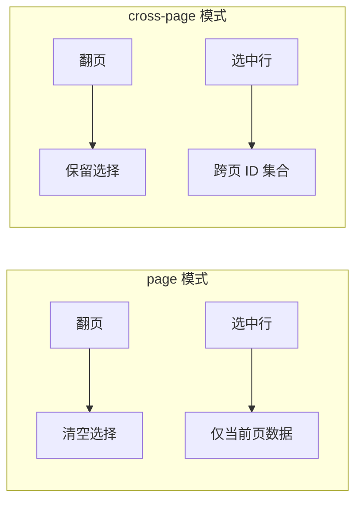
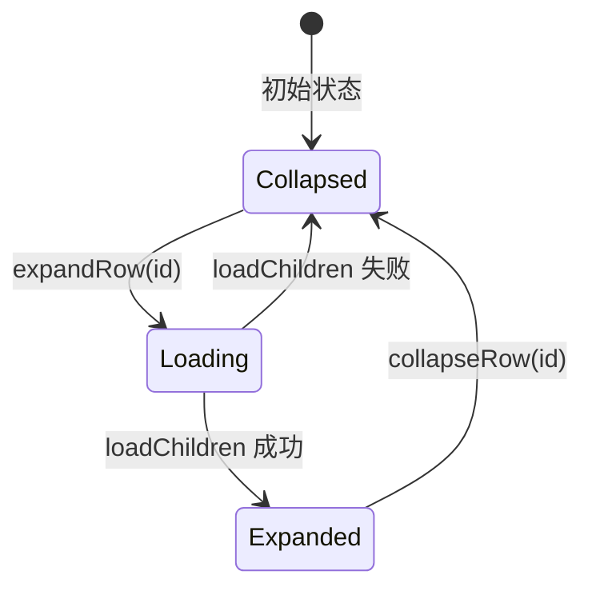
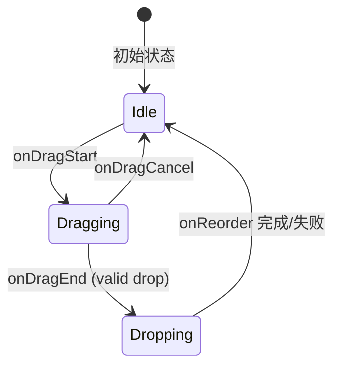

# 表格组件 V2 设计：Features 与高级能力

本文档聚焦 Feature 配置、跨页选择、列定义扩展、树形数据与行拖拽排序。

## 7.1 实现对齐补充（截至 2026-02-07）

以下与当前实现对齐（以 `src/components/table/v2/core/types.ts`、`core/features/*`、`ui/table/helpers.ts` 为准）：

- `DataTableFeatures` 实际包含 11 个能力：
  - `selection` / `columnVisibility` / `columnSizing` / `pinning` / `columnOrder`
  - `expansion` / `density` / `tree` / `dragSort` / `virtualization` / `analytics`
- `selection.crossPage` 已支持：
  - `selectAllStrategy: "client" | "server"`
  - `fetchAllIds`
  - `maxSelection`
- `pinning` 已支持持久化参数：
  - `storageKey` / `schemaVersion` / `migrate` / `storage`
- `tree` 当前不含 `scrollOnExpand`，当前实现参数为：
  - `selectionBehavior`（`independent` / `cascade`）
  - `allowNesting`
  - `indentSize`
- 拖拽放置位置枚举以实现为准：`"above" | "below" | "inside"`。
- `DataTableDropIndicator.position` 也已对齐为：`"above" | "below" | "inside"`。
- `dragSort` 额外支持 `onError` 回调，用于错误反馈。

## 8. Feature 配置（Features）

feature 的职责是：声明需要哪些 TanStack state、是否持久化、是否注入额外列/工具组件所需信息。

```ts
export interface TablePreferenceStorage<TValue> {
  getSync?: (key: string) => TValue | null
  get: (key: string) => Promise<TValue | null>
  set: (key: string, value: TValue) => Promise<void>
  remove?: (key: string) => Promise<void>
}

// 统一 feature 配置格式：{ enabled?: boolean, ...options }
// 所有 feature 的 enabled 默认为 true（传入配置对象即表示启用）

export interface SelectionFeatureOptions<TFilterSchema> {
  enabled?: boolean
  mode?: "page" | "cross-page"
  crossPage?: {
    selectAllStrategy?: "client" | "server"
    fetchAllIds?: (filters: TFilterSchema) => Promise<string[]>
    maxSelection?: number
  }
}

export interface ColumnVisibilityFeatureOptions {
  enabled?: boolean
  storageKey: string
  defaultVisible?: Record<string, boolean>
  schemaVersion?: number
  migrate?: PreferenceMigration<Record<string, boolean>>
  storage?: TablePreferenceStorage<PreferenceEnvelope<Record<string, boolean>>>
}

export interface ColumnSizingFeatureOptions {
  enabled?: boolean
  storageKey: string
  defaultSizing?: Record<string, number>
  schemaVersion?: number
  migrate?: PreferenceMigration<Record<string, number>>
  storage?: TablePreferenceStorage<PreferenceEnvelope<Record<string, number>>>
}

export interface PinningFeatureOptions {
  enabled?: boolean
  left?: string[]
  right?: string[]
  storageKey?: string
  schemaVersion?: number
  migrate?: PreferenceMigration<{ left: string[]; right: string[] }>
  storage?: TablePreferenceStorage<PreferenceEnvelope<{ left: string[]; right: string[] }>>
}

export interface ColumnOrderFeatureOptions {
  enabled?: boolean
  storageKey: string
  defaultOrder?: string[]
  schemaVersion?: number
  migrate?: PreferenceMigration<string[]>
  storage?: TablePreferenceStorage<PreferenceEnvelope<string[]>>
}

export interface ExpansionFeatureOptions<TData> {
  enabled?: boolean
  getRowCanExpand?: (row: Row<TData>) => boolean
}

export interface DensityFeatureOptions {
  enabled?: boolean
  storageKey: string
  default?: "compact" | "comfortable"
  schemaVersion?: number
  migrate?: PreferenceMigration<"compact" | "comfortable">
  storage?: TablePreferenceStorage<PreferenceEnvelope<"compact" | "comfortable">>
}

export interface TreeFeatureOptions<TData> {
  enabled?: boolean
  /** 获取行的子节点（同步数据） */
  getSubRows?: (row: TData) => TData[] | undefined
  /** 懒加载子节点（异步数据） */
  loadChildren?: (row: TData) => Promise<TData[]>
  /** 判断行是否可展开（用于懒加载场景，避免请求才知道有无子节点） */
  getRowCanExpand?: (row: TData) => boolean
  /** 默认展开的深度，0 表示全部折叠，Infinity 表示全部展开 */
  defaultExpandedDepth?: number
  /** 默认展开的行 ID 列表 */
  defaultExpandedRowIds?: string[]
  /** 选择联动策略 */
  selectionBehavior?: "independent" | "cascade"
  /** 是否允许配合 dragSort 改变层级 */
  allowNesting?: boolean
  /** 缩进宽度（像素），默认 24 */
  indentSize?: number
}

export interface DragSortFeatureOptions<TData> {
  enabled?: boolean
  /** 拖拽完成后的回调，返回 Promise 时会等待完成 */
  onReorder: (args: {
    activeId: string
    overId: string
    activeIndex: number
    overIndex: number
    activeRow: TData
    overRow: TData
    /** 重排后的完整行数据（仅平铺根节点场景可用） */
    reorderedRows?: TData[]
    dropPosition?: "above" | "below" | "inside"
    activeParentId?: string | null
    overParentId?: string | null
    targetParentId?: string | null
    targetIndex?: number
  }) => void | Promise<void>
  onError?: (args: {
    error: unknown
    activeId: string
    overId: string
    dropPosition: "above" | "below" | "inside"
  }) => void
  /** 是否使用拖拽手柄，false 时整行可拖拽 */
  handle?: boolean
  /** 判断行是否可被拖拽 */
  canDrag?: (row: TData) => boolean
  /** 判断行是否可作为放置目标 */
  canDrop?: (activeRow: TData, overRow: TData) => boolean
  /** 拖拽时的视觉反馈模式 */
  dragOverlay?: "row" | "ghost" | "minimal"
  /** 树形数据拖拽时是否允许改变层级（需同时启用 tree） */
  allowNesting?: boolean
}

export interface VirtualizationFeatureOptions {
  enabled?: boolean
  mode?: "windowed" | "infinite"
  rowHeight?: number
  overscan?: number
  loadMore?: () => void | Promise<void>
  loadMoreOffset?: number
}

export interface AnalyticsFeatureOptions<TData> {
  enabled?: boolean
  groupBy?: (row: TData) => string
  groupLabel?: (args: { group: string; count: number }) => string
  summary?: {
    label?: string
    labelColumnId?: string
    values: Record<string, (rows: TData[]) => ReactNode>
  }
}

export interface DataTableFeatures<TData, TFilterSchema> {
  selection?: SelectionFeatureOptions<TFilterSchema>
  columnVisibility?: ColumnVisibilityFeatureOptions
  columnSizing?: ColumnSizingFeatureOptions
  pinning?: PinningFeatureOptions
  columnOrder?: ColumnOrderFeatureOptions
  expansion?: ExpansionFeatureOptions<TData>
  density?: DensityFeatureOptions
  tree?: TreeFeatureOptions<TData>
  dragSort?: DragSortFeatureOptions<TData>
  virtualization?: VirtualizationFeatureOptions
  analytics?: AnalyticsFeatureOptions<TData>
}
```

约定：

- **统一配置格式**：所有 feature 配置都包含 `enabled` 字段（默认 `true`）。如需禁用已配置的 feature，设置 `enabled: false`。
- 如果 `selection` 启用，core 将提供一个标准的 selection column 工厂（或直接注入）。
- `selection.mode = "page"`：翻页后不保留上一页选择（默认更简单，适配大多数场景）。
- `selection.mode = "cross-page"`：必须提供 `getRowId`，且 selection 内部语义升级为“选中的 RowId 集合”；翻页后可重建选中状态。
- 如果 `columnVisibility/columnSizing/density` 启用，必须指定 `storageKey`，避免“没持久化导致体验不一致”。
- 偏好存储 hydration：优先使用 `getSync`（例如 localStorage）在首屏同步注入，`get` 作为异步兜底（例如 indexedDB/远端）；当存在异步 hydration 时，core 必须将 `activity.preferencesReady` 置为 `false`，并在 hydration 完成后再置为 `true`，以便 UI 避免布局跳变。
- 偏好存储值必须具备版本与迁移空间：建议统一使用带 `schemaVersion` 的 envelope，并在列定义变更时执行“删除无效 key / 新增列补默认值 / 非法值修正”的合并规则（见 25）。
- 当业务发生列重命名等不可自动推断的变更时，偏好 feature 应允许提供迁移函数，将旧 key 映射到新 key（见 25.3）。

---


## 15. 跨页选择语义

### 15.1 选择模式对比



### 15.2 跨页选择状态模型

```ts
export interface CrossPageSelection {
  mode: "include" | "exclude"
  rowIds: Set<string>
  // mode = "include": rowIds 表示被选中的行
  // mode = "exclude": rowIds 表示被排除的行（用于"全选后取消部分"场景）
}

export interface DataTableSelection<TData> {
  mode: "page" | "cross-page"

  // page 模式
  selectedRowIds: string[] // 当前页选中的 ID
  selectedRowsCurrentPage: TData[] // 当前页选中的行数据

  // cross-page 模式扩展
  crossPage?: {
    selection: CrossPageSelection
    totalSelected: number | "all" // 选中总数或"全部"
    isAllSelected: boolean
  }
}
```

### 15.3 全选语义

```ts
export interface DataTableActions {
  // ...existing actions

  // 全选当前页
  selectAllCurrentPage?: () => void

  // 全选所有匹配项（跨页）
  selectAllMatching?: () => void | Promise<void>

  // 切换为"全选排除模式"
  // 返回值：是否需要向后端请求所有 ID
  toggleSelectAllMatching?: () => {
    needsFetch: boolean
    fetch?: () => Promise<string[]>
  }

  // 清空选择
  clearSelection?: () => void

  // 反选（可选）
  invertSelection?: () => void
}
```

### 15.4 全选策略选项

```ts
export interface SelectionFeatureOptions {
  mode: "page" | "cross-page"

  // cross-page 模式专用配置
  crossPage?: {
    // 全选策略
    selectAllStrategy: "client" | "server"

    // client: 前端标记为"全选排除模式"，不请求所有 ID
    //   - 优点：无需额外请求
    //   - 缺点：批量操作时需后端支持"全选排除"语义

    // server: 请求所有匹配的 ID
    //   - 优点：前端持有完整 ID 列表
    //   - 缺点：大数据量时性能问题

    // server 模式时必须提供
    fetchAllIds?: (filters: TFilterSchema) => Promise<string[]>

    // 最大选择数量（超出时提示用户）
    maxSelection?: number
  }
}
```


---


## 17. 列定义扩展约定

### 21.1 扩展的 ColumnMeta

```ts
import type { ColumnDef, ColumnMeta } from "@tanstack/react-table"

// V2 扩展的 ColumnMeta
export interface DataTableColumnMeta extends ColumnMeta<unknown, unknown> {
  // 显示控制
  headerClassName?: string
  cellClassName?: string

  // 功能声明
  sortable?: boolean      // 是否可排序（覆盖自动推断）
  filterable?: boolean    // 是否可筛选
  filterKey?: string      // 对应的 filterSchema key

  // 持久化控制
  hideable?: boolean      // 是否允许用户隐藏，默认 true
  resizable?: boolean     // 是否允许调整宽度，默认 true

  // 固定列
  pinned?: "left" | "right" | false

  // i18n
  headerLabel?: string    // 用于 column toggle 等场景的显示名称
}
```

### 21.2 列定义 Helper 函数

V2 提供以下标准列工厂函数（通过 `createColumnHelper` 调用）：

| 函数                | 用途  | 内置配置                              |
|-------------------|-----|-----------------------------------|
| `select()`        | 选择列 | `id: __select__`, 40px 宽, 不可隐藏/调整 |
| `expand()`        | 展开列 | `id: __expand__`, 40px 宽, 不可隐藏/调整 |
| `actions(render)` | 操作列 | `id: __actions__`, 80px 宽, 固定右侧   |

### 21.3 类型安全的列定义工厂

```ts
// 提供类型推断的列定义工厂
export function createColumnHelper<TData>() {
  return {
    accessor<TValue>(
      accessor: keyof TData | ((row: TData) => TValue),
      column: Omit<ColumnDef<TData, TValue>, "accessorKey" | "accessorFn">
    ): ColumnDef<TData, TValue> {
      if (typeof accessor === "string") {
        return { ...column, accessorKey: accessor } as ColumnDef<TData, TValue>
      }
      return { ...column, accessorFn: accessor } as ColumnDef<TData, TValue>
    },

    display(column: Omit<ColumnDef<TData>, "accessorKey" | "accessorFn">): ColumnDef<TData> {
      return column as ColumnDef<TData>
    },

    select: () => createSelectColumn<TData>(),
    expand: () => createExpandColumn<TData>(),
    actions: (render: (row: TData) => ReactNode) => createActionsColumn(render),
  }
}

// 使用示例
const columnHelper = createColumnHelper<User>()

const columns = [
  columnHelper.select(),
  columnHelper.accessor("name", {
    header: "姓名",
    meta: { sortable: true, filterable: true, filterKey: "name" },
  }),
  columnHelper.accessor("email", {
    header: "邮箱",
    meta: { sortable: true },
  }),
  columnHelper.accessor((row) => row.createdAt, {
    id: "createdAt",
    header: "创建时间",
    cell: ({ getValue }) => formatDate(getValue()),
  }),
  columnHelper.actions((row) => <UserActions user={row} />),
]
```

---


## 22. 树形数据（Tree Table）设计

树形表格是企业后台的高频需求，常见于组织架构、文件目录、分类管理、权限树等场景。

### 22.1 设计目标

- 支持同步数据（一次性获取完整树）和异步懒加载（按需加载子节点）
- 与 selection、dragSort 等 feature 正交组合
- 保持 `dt` 单一数据源原则，展开状态统一管理
- 提供标准的缩进、展开/折叠图标、加载状态 UI

### 22.2 数据模型

#### 同步数据模式

```ts
interface Department {
  id: string
  name: string
  children?: Department[]  // 子节点内嵌
}

const dt = useDataTable({
  columns,
  dataSource: local({ rows: departments }),
  state: stateInternal({ initial: {} }),
  features: {
    tree: {
      getSubRows: (row) => row.children,
      defaultExpandedDepth: 1,  // 默认展开第一层
    },
  },
  getRowId: (row) => row.id,
})
```

#### 异步懒加载模式

```ts
interface Category {
  id: string
  name: string
  hasChildren: boolean  // 后端告知是否有子节点
}

const dt = useDataTable({
  columns,
  dataSource: remote({ queryKey: ["categories"], queryFn, map }),
  state: stateInternal({ initial: {} }),
  features: {
    tree: {
      getRowCanExpand: (row) => row.hasChildren,
      loadChildren: async (row) => {
        const res = await api.get(`/categories/${row.id}/children`)
        return res.data
      },
    },
  },
  getRowId: (row) => row.id,
})
```

### 22.3 展开状态管理

展开状态统一由 `dt.tree` 管理：

```ts
export interface DataTableTree {
  enabled: boolean
  expandedRowIds: string[]     // 当前展开的行 ID 列表
  loadingRowIds: string[]      // 正在加载子节点的行 ID 列表
}
```

**状态变更流程（懒加载）：**



### 22.4 与其他 Feature 的组合

| 组合场景                    | 行为约定                                                            |
|-------------------------|-----------------------------------------------------------------|
| tree + selection        | 父节点选中时，子节点状态可配置：`selectionBehavior: "independent" \| "cascade"` |
| tree + dragSort         | 需启用 `dragSort.allowNesting` 才能拖拽改变层级                            |
| tree + pagination       | **不推荐**，树形数据通常不分页；如需分页应仅对顶层节点分页                                 |
| tree + columnVisibility | 正常工作，缩进列（通常是第一列）建议设为 `hideable: false`                          |

### 22.5 UI 组件

#### 缩进与展开图标

```tsx
// 内置的树形单元格渲染器
export function DataTableTreeCell(props: {
  row: Row<TData>
  children: ReactNode  // 实际单元格内容
}): JSX.Element

// 在列定义中使用
const columns = [
  columnHelper.accessor("name", {
    header: "名称",
    cell: ({ row, getValue }) => (
      <DataTableTreeCell row={row}>
        {getValue()}
      </DataTableTreeCell>
    ),
  }),
]
```

#### 展开图标状态

| 状态       | 图标             | 说明     |
|----------|----------------|--------|
| 可展开（折叠中） | `ChevronRight` | 点击展开   |
| 已展开      | `ChevronDown`  | 点击折叠   |
| 正在加载     | `Spinner`      | 懒加载中   |
| 无子节点     | 空占位            | 保持缩进对齐 |

### 22.6 Actions API

```ts
// 在 dt.actions 中
expandRow: (rowId: string) => void           // 展开单行
collapseRow: (rowId: string) => void         // 折叠单行
toggleRowExpanded: (rowId: string) => void   // 切换展开/折叠
expandAll: () => void                         // 展开所有（慎用，大数据量时性能问题）
collapseAll: () => void                       // 折叠所有
expandToDepth: (depth: number) => void        // 展开到指定深度
```


## 23. 行拖拽排序设计

行拖拽排序用于任务列表、优先级管理、步骤编排等需要用户手动调整顺序的场景。

### 23.1 设计目标

- 提供流畅的拖拽交互体验（基于 `@dnd-kit`）
- 支持拖拽手柄模式和整行拖拽模式
- 支持与树形数据组合（跨层级拖拽）
- 明确前后端职责边界（乐观更新 vs 服务端确认）

### 23.2 基础用法

```ts
const dt = useDataTable({
  columns,
  dataSource: local({ rows: tasks }),
  state: stateInternal({ initial: {} }),
  features: {
    dragSort: {
      onReorder: ({ activeId, overId, reorderedRows }) => {
        // local 数据源：直接获得重排后的数组
        setTasks(reorderedRows)
      },
    },
  },
  getRowId: (row) => row.id,
})
```

#### 远程数据源 + 乐观更新

```ts
const dt = useDataTable({
  columns,
  dataSource: remote({ queryKey: ["tasks"], queryFn, map }),
  state: stateUrl({ key: "tasks", parsers }),
  features: {
    dragSort: {
      onReorder: async ({ activeId, overId, activeIndex, overIndex }) => {
        // 乐观更新：立即更新缓存
        queryClient.setQueryData(["tasks"], (old) =>
          arrayMove(old, activeIndex, overIndex)
        )

        try {
          // 服务端确认
          await api.post("/tasks/reorder", {
            itemId: activeId,
            targetId: overId,
            position: "after",  // 或 "before"
          })
        } catch (error) {
          // 回滚
          queryClient.invalidateQueries(["tasks"])
          throw error
        }
      },
    },
  },
  getRowId: (row) => row.id,
})
```

### 23.3 拖拽状态模型

```ts
export interface DataTableDragSort {
  enabled: boolean
  isDragging: boolean      // 是否正在拖拽
  activeId: string | null  // 当前拖拽的行 ID
}
```

**拖拽状态流转：**



### 23.4 配置选项详解

| 选项             | 类型                              | 默认值          | 说明                           |
|----------------|---------------------------------|--------------|------------------------------|
| `handle`       | `boolean`                       | `true`       | `true` 时需要拖拽手柄，`false` 时整行可拖 |
| `canDrag`      | `(row) => boolean`              | `() => true` | 控制哪些行可拖拽                     |
| `canDrop`      | `(active, over) => boolean`     | `() => true` | 控制放置目标有效性                    |
| `dragOverlay`  | `"row" \| "ghost" \| "minimal"` | `"row"`      | 拖拽时的视觉反馈                     |
| `allowNesting` | `boolean`                       | `false`      | 与 tree 组合时是否允许改变层级           |

### 23.5 UI 组件

#### 拖拽手柄列（可选）

```ts
// 使用 columnHelper 创建手柄列
const columns = [
  columnHelper.dragHandle(),  // 内置手柄列
  columnHelper.accessor("name", { header: "名称" }),
  // ...
]
```

手柄列的默认行为：
- 宽度 40px，不可隐藏、不可调整宽度
- 渲染 `GripVertical` 图标
- 鼠标悬停时显示 `cursor: grab`，拖拽时显示 `cursor: grabbing`

#### 拖拽视觉反馈

| 模式        | 说明             | 适用场景     |
|-----------|----------------|----------|
| `row`     | 拖拽时显示完整行的半透明副本 | 需要看清拖拽内容 |
| `ghost`   | 拖拽时显示行的轮廓线     | 简洁，性能更好  |
| `minimal` | 仅显示小型指示器       | 长列表，频繁拖拽 |

#### 放置指示器

```tsx
// 内置放置指示器组件
export function DataTableDropIndicator(props: {
  position: "above" | "below" | "inside"
  indentPx?: number
}): JSX.Element
```

视觉规范：
- 在目标行的上方/下方显示 2px 高亮线
- 颜色使用 `--primary`
- 动画：fade-in 150ms

### 23.6 与树形数据组合

当同时启用 `tree` 和 `dragSort` 时：

```ts
features: {
  tree: {
    getSubRows: (row) => row.children,
  },
  dragSort: {
    allowNesting: true,  // 允许拖拽改变层级
    onReorder: ({ activeId, overId, dropPosition }) => {
      // dropPosition: "above" | "below" | "inside"
      // "inside" 表示作为目标节点的子节点
    },
    canDrop: (activeRow, overRow) => {
      // 防止将父节点拖入自己的子节点
      return !isDescendant(activeRow, overRow)
    },
  },
}
```

#### 层级拖拽的放置策略

| 放置位置 | 触发条件           | 结果        |
|------|----------------|-----------|
| 上方   | 鼠标在行的上 1/4 区域  | 成为同级，排在前面 |
| 下方   | 鼠标在行的下 1/4 区域  | 成为同级，排在后面 |
| 内部   | 鼠标在行的中间 1/2 区域 | 成为子节点     |

### 23.7 Actions API

```ts
// 在 dt.actions 中
moveRow: (activeId: string, overId: string) => void | Promise<void>
```

**注意**：`moveRow` 通常不需要业务直接调用，由 UI 层的拖拽事件自动触发。暴露此方法是为了：
- 测试场景
- 键盘操作（见 28.8）
- 编程式排序

---
