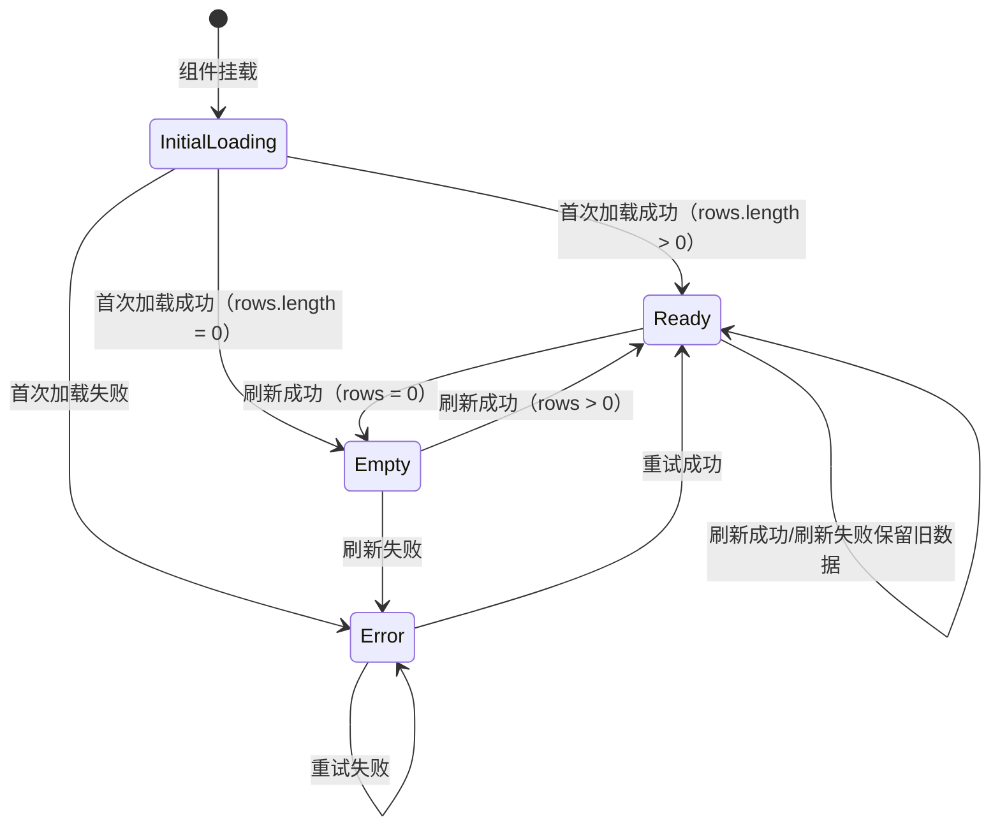

# 表格组件 V2 设计：UI 与交互规范

本文档聚焦组件层 API、状态反馈、i18n/a11y、错误处理与筛选器 UI 规范。

## 8.1 实现对齐补充（截至 2026-02-07）

以当前导出与实现为准（`src/components/table/v2/ui/*`）：

- `DataTableSelectionBar.actions` 回调参数当前额外包含：
  - `selectionScope`
  - `exportPayload`
- `DataTableTable` 已支持 `renderSubComponent`（行展开内容渲染）。
- `DataTableViewOptions` 已集成列显隐、密度切换、重置列固定、重置列顺序、重置全部。
- 文中的示例配置 `features: { selection: true }` 为旧写法；当前应使用对象写法（例如 `selection: { enabled: true }`）。

## 9. UI API（组件层，对外导出建议）

UI 层只依赖 `dt`，不直接依赖 URL/Query。

### 9.1 Root 与子组件

```tsx
export type DataTableScrollContainer = "root" | "window"

export interface DataTableLayoutOptions {
  scrollContainer?: DataTableScrollContainer
  stickyHeader?: boolean | { topOffset?: number }
  stickyPagination?: boolean | { bottomOffset?: number }
}

export function DataTableRoot<TData, TFilterSchema>(props: {
  dt: DataTableInstance<TData, TFilterSchema>
  height?: string
  className?: string
  layout?: DataTableLayoutOptions
  children: ReactNode
}): JSX.Element

export function DataTablePreset<TData, TFilterSchema>(props: {
  dt: DataTableInstance<TData, TFilterSchema>
  height?: string
  className?: string
  layout?: DataTableLayoutOptions
  toolbar?: ReactNode
  toolbarActions?: ReactNode
  renderEmpty?: () => ReactNode
  renderError?: (error: unknown, retry?: () => void | Promise<void>) => ReactNode
  selectionBarActions?: (args: {
    selectedRowIds: string[]
    selectedRowsCurrentPage: TData[]
    mode: "page" | "cross-page"
  }) => ReactNode
}): JSX.Element

export function DataTableToolbar(props: { children?: ReactNode; actions?: ReactNode }): JSX.Element
export function DataTableSearch<TFilterSchema>(props: {
  filterKey?: keyof TFilterSchema
  placeholder?: string
  debounceMs?: number
  className?: string
  inputClassName?: string
  i18n?: DataTableI18nOverrides
  mode?: "simple" | "advanced"
  advancedFields?: FilterDefinition<TFilterSchema, keyof TFilterSchema>[]
}): JSX.Element
export function DataTableViewOptions(props?: {
  showResetAll?: boolean
}): JSX.Element
export function DataTableColumnToggle(): JSX.Element
export function DataTableDensityToggle(): JSX.Element
export function DataTableTable(props?: {
  renderEmpty?: () => ReactNode
  renderError?: (error: unknown, retry?: () => void | Promise<void>) => ReactNode
}): JSX.Element
export function DataTablePagination(): JSX.Element
export function DataTableSelectionBar<TData>(props: {
  actions?: (args: {
    selectedRowIds: string[]
    selectedRowsCurrentPage: TData[]
    mode: "page" | "cross-page"
    selection: DataTableSelection<TData>
  }) => ReactNode
}): JSX.Element
```

说明：

- 需要“一把梭”的标准 CRUD 列表，优先使用 `DataTablePreset`；需要深度定制时再回退到组合式（见 9.2）。
- `DataTableSearch` 只更新 `dt.filters.set(filterKey, value)`，`filterKey` 解析优先级为：`props.filterKey > dt.meta.state.searchKey > "q"`。
- `DataTableSearch` 内置输入尾部清空按钮；清空后立即写回空值，并取消 pending 的 debounce。
- `DataTableSearch.debounceMs` 默认 300ms；URL 模式下由 state adapter 负责将“输入态”和“已提交态”统一为一个规范（UI 不直接操作 URL）。
- `DataTableSearch.mode = "simple"` 为默认行为；`mode = "advanced"` 启用结构化搜索（字段选择 + 条件输入 + 回车/确认提交）。
- `DataTableSearch.mode = "advanced"` 当前支持 `text` / `select` / `multi-select` / `boolean` / `number-range` / `date` / `date-range` 七种字段类型。
- `DataTablePagination` 调用 `dt.actions.setPage/setPageSize`，显示 `dt.pagination`。
- `DataTableTable` 仅渲染 table（header/body/empty/error/loading），其状态来自 `dt.status`。
- `DataTableSelectionBar` 以 `selectedRowIds` 为跨页批量的主入口；`selectedRowsCurrentPage` 仅用于“当前页批量”或展示选中摘要。
- 当 `selection.mode = "cross-page"` 时，UI 建议遵循跨页选择的标准交互（见 26.2），避免用户误解“到底选了多少条”。
- `DataTableViewOptions` 作为推荐的“低频视图配置入口”，统一承载密度切换、列设置与恢复默认操作。
- `DataTableColumnToggle` 与 `DataTableDensityToggle` 保留为底层原子组件，用于高度定制页面。
- `layout` 属于 UI 布局能力，不进入 core features；core 不感知滚动容器与 sticky 行为。

### 9.2 默认布局（一把梭用法）

```tsx
const dt = useDataTable({
  columns,
  dataSource: remote({ queryKey: ["users"], queryFn: getUsers, map }),
  state: stateUrl({ key: "users", parsers }),
  features: {
    selection: { enabled: true, mode: "page" },
    columnVisibility: { storageKey: "users.columns" },
  },
})

return <DataTablePreset dt={dt} height="calc(100vh - 240px)" layout={{ scrollContainer: "root", stickyHeader: true }} />
```

如需定制 toolbar、selectionBar、pagination 的布局或插槽，可使用组合式 API：

```tsx
return (
  <DataTableRoot
    dt={dt}
    height="calc(100vh - 240px)"
    layout={{
      scrollContainer: "root",
      stickyHeader: true,
    }}
  >
    <DataTableToolbar
      actions={
        <div className="flex items-center gap-2">
          <Button type="button" variant="outline" size="icon-sm" aria-label="刷新" onClick={dt.actions.refetch}>
            <RefreshCw className="h-4 w-4" />
          </Button>
          <DataTableViewOptions />
        </div>
      }
    >
      <DataTableSearch filterKey="q" />
    </DataTableToolbar>
    <DataTableTable />
    <DataTableSelectionBar
      actions={({ selectedRowIds, selectedRowsCurrentPage, mode }) => (
        <BatchActions
          selectedRowIds={selectedRowIds}
          selectedRowsCurrentPage={selectedRowsCurrentPage}
          mode={mode}
        />
      )}
    />
    <DataTablePagination />
  </DataTableRoot>
)
```

### 9.3 布局与滚动（Layout & Scrolling）

V2 将“表头吸顶 / 分页吸底”等能力定义为 UI 层布局规范，由 `DataTableRoot` 统一协调。这样可以保持 headless core 的纯粹性：core 只管理 `dt`（table/state/actions/data），不承载 DOM、滚动容器与 CSS sticky 语义。

#### 9.3.1 滚动容器策略

- `layout.scrollContainer = "root"`：表格在 `DataTableRoot` 内部滚动。此模式下通常需要 `height`（或由父容器约束高度）以形成稳定的滚动区域。
- `layout.scrollContainer = "window"`：表格跟随页面滚动。此模式下 sticky 需要使用 `topOffset/bottomOffset` 适配页面顶部导航、面包屑等占位。
- **偏移量注入**：推荐支持 CSS 变量 `--dt-sticky-top` / `--dt-sticky-bottom` 作为默认偏移源；业务层只需在布局容器上设置变量即可动态适配。
- **可选上下文**：如需更复杂的动态布局，可提供 `StickyContext` 供外部注入实时偏移量（优先级高于 CSS 变量）。

#### 9.3.2 表头吸顶（Sticky Header）

- 启用方式：`layout.stickyHeader = true` 或传 `{ topOffset }`。
- 推荐行为：
  - `"root"`：`DataTableTable` 的 header 区（如 `thead`）使用 `position: sticky; top: 0` 固定在滚动容器顶部。
  - `"window"`：header 区使用 `position: sticky; top: topOffset` 固定在窗口视口内。

#### 9.3.3 分页吸底（Bottom Dock / Sticky Pagination）

- `"root"`：分页不建议用 `sticky`。推荐由 `DataTableRoot` 使用布局容器（例如 column flex/grid）将 `DataTablePagination` 放在滚动区域之外，自然“吸底”，同时避免与虚拟滚动/表体高度计算产生耦合。
- `"window"`：可启用 `layout.stickyPagination = true` 或传 `{ bottomOffset }`，使分页在窗口滚动时保持在视口底部附近。

#### 9.3.4 约束与边界

- 层级（z-index）：sticky header 必须高于 `tbody`；如果启用 pinning，固定列 header 的交叉区域层级必须更高，避免遮挡/穿透。
- 视觉提示：当发生滚动且 sticky header 生效时，UI 建议提供轻量的分隔提示（例如阴影或边框），用于表达“已脱离正常文档流”。
- 高度约束：`scrollContainer="root"` 时必须存在确定的高度约束，否则内部滚动与吸顶行为会退化为普通流式布局。
- 虚拟滚动预留：未来引入虚拟滚动时，sticky header 可能由虚拟滚动实现接管；`layout` 的 API 形状保持不变，作为 UI 策略选择的入口。

---

## 10. 状态机与 UI 反馈标准

### 10.1 status 规范

- `error`：展示 error state，并提供 retry（`dt.actions.retry`）。
- `empty`：展示 empty state（允许 i18n/slot 覆盖）。
- `ready`：正常渲染 rows。

### 10.2 fetching（刷新态）

刷新态不进入 `status`，统一由 `dt.activity.isFetching` 表达：

- `dt.activity.isInitialLoading = true`：首次加载且无可渲染数据，UI 展示骨架屏/全屏 loading。
- `dt.activity.isFetching = true`：已有数据但后台刷新（翻页、筛选、排序触发的请求），UI 建议展示轻量反馈（进度条/局部蒙层/按钮 loading），避免打断阅读。

约定：

- `status` 只表达“主渲染态”（error/empty/ready），避免与 fetching 组合导致状态机膨胀。
- “stale 数据 + error”：当存在可渲染数据且请求失败时，保持 `status=ready`，同时设置 `errors.nonBlocking`；UI 以非阻断方式展示错误与重试入口（toast/banner/按钮态）。

### 10.3 主状态机（Status 流转）



### 10.4 Status 与 Activity 协作矩阵

| 场景         | status.type | isInitialLoading | isFetching | errors        |
|------------|-------------|------------------|------------|---------------|
| 首次加载中      | -           | `true`           | `true`     | -             |
| 首次加载成功，有数据 | `ready`     | `false`          | `false`    | -             |
| 首次加载成功，无数据 | `empty`     | `false`          | `false`    | -             |
| 首次加载失败     | `error`     | `false`          | `false`    | `blocking`    |
| 有数据，后台刷新中  | `ready`     | `false`          | `true`     | -             |
| 有数据，刷新失败   | `ready`     | `false`          | `false`    | `nonBlocking` |

---

## 11. 性能与引用稳定性约束

V2 必须保证“重渲染不扩散”，否则会出现每次 dt 变化导致 Cell 全量刷新。

约定：

- `useDataTable` 内部必须保证这些引用稳定：
  - `dt.actions`：使用稳定的回调与 memo 容器。
  - `dt.filters`：对外暴露的对象引用稳定，只在其内部字段变化。
  - `dt`：可以不要求整体对象稳定。
- 当前实现使用 `DataTableProvider` 直接提供 `dt` 单一 Context；若后续在大表格场景出现明显渲染压力，可演进为 Context 拆分或 selector 方案。
- 对 Cell/Row 等热点组件使用 memo（在不破坏正确性的前提下）。

selector API 形态建议如下：

```ts
export type DataTableSelector<TData, TFilterSchema, TSelected> = (
  dt: DataTableInstance<TData, TFilterSchema>,
) => TSelected

export function useDataTableSelector<TData, TFilterSchema, TSelected>(
  selector: DataTableSelector<TData, TFilterSchema, TSelected>,
): TSelected
```

---

## 12. i18n 与可访问性约束

### 12.1 i18n

所有文案统一来自 `TableConfigProvider`：

- `emptyText/loadingText/refreshingText`
- pagination 文案
- column toggle 文案
- search placeholder
- search 清空按钮 aria 文案
- view options 文案（触发器、密度分组、恢复默认）

组件允许局部覆盖，但不得硬编码默认值。

建议接口形态：

```ts
export interface DataTableI18n {
  emptyText: string
  loadingText: string
  refreshingText: string
  retryText: string
  searchPlaceholder: string
  clearSearchAriaLabel: string
  columnToggleLabel: string
  selectionCheckboxLabel: string
  viewOptions: {
    triggerAriaLabel: string
    densityLabel: string
    resetAllText: string
  }
  pagination: {
    prevPage: string
    nextPage: string
    pageSize: string
    total: (total: number) => string
  }
}
```

### 12.2 可访问性

- icon-only button 必须有可访问性名称（`aria-label`），且默认从 i18n 提供。
- 搜索清空按钮与 View Options 触发器必须提供可访问性名称（建议由 i18n 下发）。
- selection checkbox 的 `aria-label` 统一配置，不在列定义里写死英文。

---


## 13. 错误处理策略


### 13.1 错误类型定义

```ts
export type ErrorSeverity = "blocking" | "nonBlocking"

export interface DataTableError {
  severity: ErrorSeverity
  code: string
  message: string
  original: unknown
  retryable: boolean
}

export interface DataTableErrors {
  blocking?: DataTableError
  nonBlocking?: DataTableError
}
```

### 13.2 错误处理原则

- **blocking**：首次加载失败、无可渲染数据时的刷新失败 → 全屏错误态
- **nonBlocking**：有数据时后台刷新失败 → 保留旧数据，轻量提示（toast/banner）
- **retryable**：4xx 参数错误外的大部分错误均可重试

### 13.3 UI 反馈规范

- **blocking**：替代整个表格区域，显示错误图标、信息与重试按钮
- **nonBlocking**：Toast/Banner 形式展示，提供"重试"和"关闭"操作

---


## 16. 筛选器 UI 层规范

### 20.1 筛选器组件体系

```
DataTableToolbar
├── DataTableSearch          # 全局搜索（支持 simple/advanced）
├── DataTableFilterBar       # 筛选条容器
│   └── DataTableFilterItem  # 单个筛选项（内置清空）
└── DataTableActiveFilters   # 已激活筛选标签展示
```

### 20.2 筛选器类型定义

```ts
export type FilterType =
  | "text"           // 文本输入
  | "select"         // 单选下拉
  | "multi-select"   // 多选下拉
  | "date"           // 日期选择
  | "date-range"     // 日期范围
  | "number-range"   // 数字范围
  | "boolean"        // 布尔开关
  | "custom"         // 自定义渲染

export interface FilterDefinition<TFilterSchema, K extends keyof TFilterSchema> {
  key: K
  label: string
  type: FilterType

  // 类型特定配置
  options?: { label: string; value: TFilterSchema[K] }[] // 用于 select/multi-select
  placeholder?: string

  // 自定义渲染
  render?: (props: {
    value: TFilterSchema[K]
    onChange: (value: TFilterSchema[K]) => void
    onRemove: () => void
  }) => ReactNode

  // 显示控制
  defaultVisible?: boolean // 是否默认显示在筛选条
  alwaysVisible?: boolean  // 是否始终显示（不可收起）
}

export interface DataTableFilterBarProps<TFilterSchema> {
  filters: FilterDefinition<TFilterSchema, keyof TFilterSchema>[]
  activeFilters?: FilterDefinition<TFilterSchema, keyof TFilterSchema>[] // 仅用于激活标签展示
  showActiveFilters?: boolean // 是否显示已激活筛选标签
  collapsible?: boolean       // 是否可折叠
  maxVisible?: number         // 默认显示的最大筛选项数
  labelMode?: "top" | "inside"
  showItemClearButtons?: boolean // 默认: showActiveFilters=true 时自动隐藏项内清空按钮
  className?: string
}
```

### 20.3 筛选器与 dt.filters 协作

```tsx
// 筛选器组件内部实现
function DataTableFilterItem<TFilterSchema, K extends keyof TFilterSchema>({
  definition,
}: {
  definition: FilterDefinition<TFilterSchema, K>
}) {
  const dt = useDataTableInstance<unknown, TFilterSchema>()

  // 从 dt.filters.state 读取当前值
  const value = dt.filters.state[definition.key]

  // 通过 dt.filters.set 更新值
  const handleChange = (newValue: TFilterSchema[K]) => {
    dt.filters.set(definition.key, newValue)
    // 注意：state adapter 会自动处理 resetPageOnFilterChange
  }

  // 清空语义：text -> ""；其他类型 -> null
  const handleRemove = () => {
    dt.filters.set(
      definition.key,
      (definition.type === "text" ? "" : null) as TFilterSchema[K],
    )
  }

  return renderFilterByType(definition.type, {
    value,
    onChange: handleChange,
    onRemove: handleRemove,
  })
}
```

### 20.4 已激活筛选标签

```tsx
export function DataTableActiveFilters<TFilterSchema>(props: {
  filters: FilterDefinition<TFilterSchema, keyof TFilterSchema>[]
  renderTag?: (props: {
    filter: FilterDefinition<TFilterSchema, keyof TFilterSchema>
    value: unknown
    onRemove: () => void
  }) => ReactNode
}): JSX.Element
```

**默认行为：**
- 只展示值不为 `null`/`undefined`/空字符串/空数组的筛选项
- 以 Tag/Chip 形式展示，点击 X 可移除单个筛选
- 支持"清除全部"操作

### 20.5 清空交互约定

- `DataTableSearch` 的清空行为应作为默认能力，不要求业务额外添加“重置筛选”按钮。
- `DataTableFilterItem` 应支持单项清空（建议在标签区/标题区提供 X 按钮）。
- 页面级“清空全部筛选”可通过 `DataTableActiveFilters` 或显式按钮触发 `dt.filters.reset()`。
- 文本类型筛选（`type = "text"`）的单项清空值应统一为 `""`；其余类型统一为 `null`（或类型对应空值）。

---
